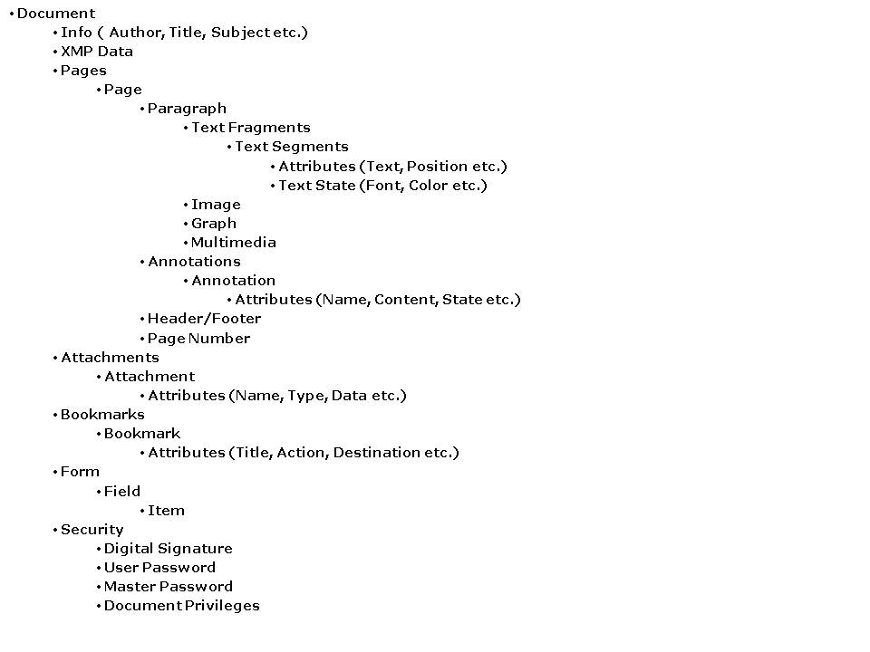

## **Introduction to the DOM API**
Document Object Model (DOM) is a form of representation of structured documents as an object-oriented model. DOM is the official World Wide Web Consortium (W3C) standard for representing structured document s in a platform and language-neutral manner.

In simple words, DOM is a tree of objects that represent the structure of some document. Aspose.PDF for .NET also uses the idea of DOM to represent the structure of a PDF document in terms of objects. However, the aspects of the DOM (such as its Elements) are manipulated within the syntax of the programming language in use. The public interface of a DOM is specified in its application programming interface (API).
### **Introduction to PDF Document**
Portable Document Format (PDF) is an open standard for document exchange. A PDF document is a combination of text and binary data. If you open it in a text editor, you will see the raw objects that define the structure and contents of the document.

The logical structure of a PDF file is hierarchical and determines the sequence by which a viewing application draws the document’s pages and their contents. A PDF is composed of four components: objects, file structure, document structure and content streams.
### **PDF Document Structure**
As the structure of a PDF file is hierarchical, Aspose.PDF for .NET also accesses the elements in the same way. The following hierarchy shows you how the PDF document is logically structured and how Aspose.PDF for .NET DOM API constructs it. 

### **Accessing PDF Document Elements**
The Document object is at the root level of the object model. The Aspose.PDF for .NET DOM API allows you to create a Document object and then access all other objects in the hierarchy. You can either access any of the collections like Pages or individual element like Page etc. The DOM API provides single entry and exit points to manipulate the PDF document as shown below:

1. Open PDF document
1. Access PDF document structure in DOM style
1. Update data in the PDF document
1. Validate PDF document
1. Export PDF document into different formats
1. Finally, save the updated PDF document
## **How to Use New Aspose.PDF for .NET API**
This topic will explain the new Aspose.PDF for .NET API and guide you to get started quickly and easily. Please note that the details regarding the use of the particular features are not the part of this article. You will find details, examples and code snippets in the [Developer Guide](/pdf/net/developer-guide/) and [Technical Articles](/pdf/net/technical-articles/) sections.

The new Aspose.PDF for .NET is composed of three parts:

1. Aspose.PDF for .NET DOM API
1. Aspose.PDF.Generator (old Aspose.PDF for .NET [pre-6.x](/pdf/net/aspose-pdf-articles/))
1. Aspose.PDF.Facades (old Aspose.PDF.Kit for .NET)

You'll find the details of each of these areas below.
### **Aspose.PDF for .NET DOM API**
The new API of Aspose.PDF for .NET is DOM based. You can find more details about the DOM API and PDF document structure in the article [Introduction to DOM API|Introduction to DOM API. In this section, we'll elaborate the use of the new DOM API.

The new Aspose.PDF for .NET DOM API corresponds to the PDF document structure, which helps you to work with the PDF documents not only at the file and document level, but also at the object level. We have provided more flexibility to the developers to access all of the elements and objects of the PDF document. Using the Aspose.PDF DOM API's classes, you can gain programmatic access to document elements and formatting. This new DOM API is comprised of various namespaces as given below:
#### **Aspose.PDF**
This namespace provides the [Document](https://apireference.aspose.com/net/pdf/aspose.pdf/document) class which allows you to open and save a PDF document. The [License](https://apireference.aspose.com/net/pdf/aspose.pdf/license) class is also a part of this namespace. It also provides classes related to PDF pages, attachments, and bookmarks like [Page](https://apireference.aspose.com/net/pdf/aspose.pdf/page), [PageCollection](https://apireference.aspose.com/net/pdf/aspose.pdf/pagecollection), [FileSpecification](https://apireference.aspose.com/net/pdf/aspose.pdf/filespecification), [EmbeddedFileCollection](https://apireference.aspose.com/net/pdf/aspose.pdf/embeddedfilecollection), [OutlineItemCollection](https://apireference.aspose.com/net/pdf/aspose.pdf/outlineitemcollection), and [OutlineCollection](https://apireference.aspose.com/net/pdf/aspose.pdf/outlinecollection) etc.
#### **Aspose.Text**
This namespace provides classes which help you work with the text and its various aspects, for example Font, FontCollection, FontRepository, FontStyles, TextAbsorber, TextFragment, TextFragmentAbsorber, TextFragmentCollection, TextFragmentState, TextSegment and TextSegmentCollection etc.
#### **Aspose.Text.TextOptions**
This namespace provides classes that allow you to set different options for searching, editing or replacing text, for example TextEditOptions, TextReplaceOptions and TextSearchOptions.
#### **Aspose.InteractiveFeatures**
This namespace contains classes that help you work with the interactive features of the PDF document, for example working with the document and other actions. This namespace contains classes like GoToAction, GoToRemoteAction and GoToURIAction etc.
#### **Aspose.InteractiveFeatures.Annotations**
Annotations are a part of a PDF document's interactive features. We have dedicated a namespace for annotations. This namespace contains classes that help you work with the annotations, for example, Annotation, AnnotationCollection, CircleAnnotation and LinkAnnotation etc.
#### **Aspose.InteractiveFeatures.Forms**
This namespace contains classes that help you work with PDF forms and form fields, for example Form, Field, TextBoxField and OptionCollection etc.
#### **Aspose.PDF.Devices**
We can perform various operations on the PDF documents such as converting PDF document to various image formats. However, such operations do not belong to the Document object and we cannot extend the [Document](https://apireference.aspose.com/net/pdf/aspose.pdf/document) class for such operations. That's why we have introduced the concept of the Device in the new DOM API.
#### **Aspose.PDF.Generator**
The old Aspose.PDF for.NET (pre-6.0) provided the features to create new PDF file from scratch. As we have merged old Aspose.PDF and Aspose.PDF.Kit, all the classes previously available in old Aspose.PDF for .NET have been moved under the Aspose.PDF.Generator namespace. So, if you want to execute the old Aspose.PDF code using the new product, use this namespace.

{} 

This namespace is obsolete and starting Aspose.PDF for .NET 17.5, it is removed from API.

{} 
### **Aspose.PDF.Facades**
Previous to Aspose.PDF for .NET t.o.o, you needed Aspose.PDF.Kit for .NET to manipulate existing PDF files. To execute old Aspose.PDF.Kit code, can use [Aspose.PDF.Facades](https://docs-qa.aspose.com/display/pdftemp/Aspose.Pdf.Facades+namespace) namespace.
## **How to Use New Documentation**
This topic describes programming essentials you need to build applications using Aspose.PDF for .NET. It provides information about key programming concepts, as well as code samples and explanations. We have added this article to explain how you can effectively use this documentation to learn the Aspose.PDF for .NET easily and understand the concepts quickly. 
As the new Aspose.PDF for .NET (6.x and above) is not only a merged product of Aspose.PDF for .NET (pre-6.x) and Aspose.PDF.Kit, but also introduces a completely new DOM API to work with PDF files. So, this documentation contains sections for new DOM API, old Aspose.PDF for .NET (pre-6.x) and Aspose.PDF.Kit. With this new version, you can either work with the new DOM API or the legacy code using a single component; and this article will guide you through the whole process.
### **Product Features**
This documentation contains three main sections: Product Information, Programmer’s Guide, and Knowledge Base. In Product Information section, you’ll find a Features sub-section, under Getting Started section: Product Information -> Getting Started -> Features. In the Features section, we have provided three pages. Each page provides a list of the features of a particular section of the new Aspose.PDF for.NET. The details of these three features pages are given below:

**Aspose.PDF Features:** This page lists all the features supported in new Aspose.PDF DOM API.

**Aspose.PDF** **.Facades** **Features:** This page lists all the features supported by old Aspose.PDF.Kit for .NET. All the classes which were previously available in old Aspose.PDF.Kit can be found under Aspose.PDF.Facades namespace. That’s why we have listed all the related features on this page.
### **Programmer’s Guide**
The Programmer’s Guide is also divided into three sections. Each Programmer’s Guide section corresponds to a particular section of the new Aspose.PDF for .NET. The details of these three sections are given below:

**Working with Aspose.PDF:** If you want to work with new Aspose.PDF for .NET, please see this section for help. This section is further divided into sub-sections according to the features supported by new DOM API.

**Working with Aspose.PDF** **.Facades** **:** If you want to work with old Aspose.PDF.Kit for .NET, please see this section. This section is further divided into sub-sections according to the features supported by Aspose.PDF.Facades namespace (old Aspose.PDF.Kit for .NET).
### **Technical Articles**
Technical Articles section under Knowledge Base is divided into sub-sections for clarity. At the root level of the Technical Articles section, you will find some articles which can help you understand the new DOM API and get started with the product and the documentation. However, the technical articles specific to a particular area of the product are placed under a separate section. There are three sub-sections under Technical Articles section as given below:

**Aspose.PDF Articles:** This section contains articles related to new Aspose.PDF for .NET DOM API.

**Aspose.PDF** **.Facades** **Articles:** This section contains articles related to Aspose.PDF.Facades (old Aspose.PDF.Kit for .NET)
### **Migration to Aspose.PDF for .NET 6.x**
We have also added a sub-section named **Migration to Aspose.PDF for .NET 6.x**. This section guides you how to migrate from old Aspose.PDF for .NET and old Aspose.PDF.Kit for.NET to new Aspose.PDF for .NET. We have further divided this section into two subsections as given below:

**Migration from Aspose.PDF for .NET Pre-6.x:** This section contains the help topics which guide you to migrate from old Aspose.PDF for .NET (pre-6.x) to new Aspose.PDF for .NET.

**Migration from Aspose.PDF.Kit** **for .NET:** This section contains the help topics which guide you to migrate from old Aspose.PDF.Kit for .NET to new Aspose.PDF for .NET.

This documentation is not static; we’ll keep adding more help topics, articles and tutorials in this documentation. If you want to see some specific topics in the documentation or have some suggestions, please do let us know.
