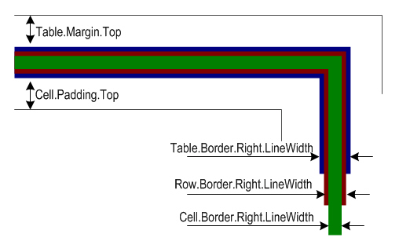

## **Set Border Style, Margins and Padding of the Table (MergedAPI)**
[Aspose.PDF for .NET](/pdf/net/home-html/) allows developers to create tables in PDF documents. Moreover, they can apply effects like border style, margins and cell padding, to the tables. Before going into more technical details, it's important to understand the concepts of border, margins and padding which are presented below in a diagram:

**Borders, margins and padding** 

In the above figure, you can see that the borders of the table, row and cell overlap. Using Aspose.PDF for .NET, a table can have margins and cells padding. To set a cell's margin, we have to set cell padding.
### **Borders**
To set the borders of Table, [Row](https://apireference.aspose.com/net/pdf/aspose.pdf/row) and [Cell](https://apireference.aspose.com/net/pdf/aspose.pdf/cell) objects, use the Table.Border, Row.Border and Cell.Border properties. Cell borders can also be set using the [Table](https://apireference.aspose.com/net/pdf/aspose.pdf/table) or Row class' DefaultCellBorder property. All border related properties discussed above are assigned an instance of the [Row](https://apireference.aspose.com/net/pdf/aspose.pdf/row) class, which is created by calling its constructor. The Row class has many overloads that take almost all the parameters required to customize the border.
### **Margins or Padding**
Cell padding can be managed using the Table class' [DefaultCellPadding](https://apireference.aspose.com/net/pdf/aspose.pdf/table/properties/defaultcellpadding) property . All padding related properties are assigned an instance of the [MarginInfo](https://apireference.aspose.com/net/pdf/aspose.pdf/margininfo) class that takes information about the Left, Right, Top and Bottom parameters to create custom margins.

In the following example, the width of the cell border is set to 0.1 point, the width of the table border is set to 1 point and cell padding is set to 5 points.



To create table with rounded corner, use the BorderInfo class' RoundedBorderRadius value and set the table corner style to round.


### **Double Border**
As stated above, the border can be added to Table or Cell objects. Our users have requested that we add a feature that allows them to add a double border around Table and Cell objects. This feature was added with Aspose.PDF for .NET 8.8.0. The code snippet below shows how to accomplish this requirement.


## **Integrate Table with Database (DOM)**
Databases are built to store and manage data. It's common practice for programmers to populate different objects with data from databases. This article discusses adding data from a database into a table. It is possible to populate a [Table](https://apireference.aspose.com/net/pdf/aspose.pdf/table) object with data from any data source using Aspose.PDF for .NET. And it's not only possible but it's very easy.

[Aspose.PDF for .NET](/pdf/net/) allows developers to import data from:

- Object Array
- DataTable
- DataView

This topic provides information about fetching data from a DataTable or DataView.

All developers working under .NET platform must be familiar with the basic ADO.NET concepts introduced by .NET Framework. It is possible to connect to almost all kinds of data sources using ADO.NET. We can retrieve data from databases and save it to a DataSet, DataTable or DataView. Aspose.PDF for .NET provides support for importing data from these too. This gives more freedom to developers to populate tables in PDF documents from any data source.

The ImportDataTable(..) and ImportDataView(..) methods of the Table class are used to import data from databases.

The example below demonstrates the use of the ImportDataTable method. In this example, the DataTable object is created from scratch and records are added programmatically instead of filling the DataTable with data from databases. Developers can populate DataTable from the database too according to their desire.


## **How to determine if table will break in the current page**
Tables are by default added from top-left position and if the table reaches the end of the page, it automatically breaks. You can programmatically get the information that either the Table will be accommodated in the current page or it will break at the bottom of the page. For that reason, first, you need to get the document size information, then you need to get the page Top and page Bottom margin information, Table top margin information and table height. If you add page Top Margin + page Bottom Margin + table Top Margin + table Height and deduct it from the document height, you can get the amount of space remaining over the document. Depending upon the particular height of row (which you have specified), you can calculate that if all the rows of a table can be accommodated within the remaining space over a page or not. Please take a look over the following code snippet. In the following code, the average row height is 23.002 Points.


## **Add Repeating Column in Table**
In the Aspose.Pdf.Table class, you can set a RepeatingRowsCount that will repeat rows if the table is too long vertically and overflows to the next page. However, in some cases, tables are too wide to fit on a single page and needs to be continued to the next page. In order to serve the purpose, we have implemented RepeatingColumnsCount property in Aspose.Pdf.Table class. Setting this property will cause the table to break to next page column-wise and repeat given column count in the start of the next page. Following code snippet shows the usage of RepeatingColumnsCount property:


## **Manipulate tables in existing PDF**
One of the earliest features supported by Aspose.PDF for .NET is its capabilities of [Working with Tables](http://www.aspose.com/docs/display/pdfnet/Working+with+Tables) and it provides great support for adding tables in PDF files being generated from scratch or any existing PDF files. You also get the capability to [Integrate Table with Database (DOM)](/pdf/net/manipulate-and-integrate-table/#manipulateandintegratetable-integratetablewithdatabase-dom) to create dynamic tables based on database contents. In this new release, we have implemented new feature of searching and parsing simple tables that already exist on page of PDF document. A new class named **Aspose.PDF.Text.TableAbsorber** provides these capabilities. The usage of TableAbsorber is very much similar to existing TextFragmentAbsorber class. The following code snippet shows the steps to update contents in particular table cell.


### **Remove Table from PDF document**
We have added new function i.e. Remove() to the existing TableAbsorber Class in order to remove table from PDF document. Once the absorber successfully finds tables on the page, it becomes capable to remove them. Please check following code snippet showing how to remove a table from PDF document:


### **Remove Multiple Tables from PDF document**
Sometimes a PDF document may contain more than one table and you may come up with a requirement to remove multiple tables from it. In order to remove multiple tables from PDF document, please use the following code snippet:



{} 

Please take into account that removing or replacing of a table changes TableList collection. Therefore, in case removing/replacing tables in a loop the copying of TableList collection is essential.

{} 
### **Replace old Table with a new one in PDF document**
In case you need to find a particular table and replace it with the desired one, you can use Replace() the method of [TableAbsorber](https://apireference.aspose.com/net/pdf/aspose.pdf.text/tableabsorber) Class in order to do that. Following example demonstrate the functionality to replace the table inside PDF document:


