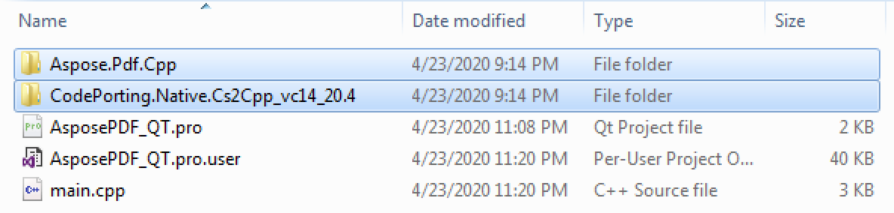
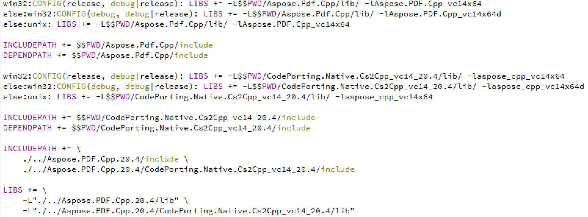

Qt is a cross-platform application development framework that allows creating a variety of desktop, mobile, web, and embedded system applications. In this article, we will see how you can integrate our C++ PDF library to work with PDF documents in your Qt applications.
## **Using Aspose.PDF for C++ within Qt**
In order to use Aspose.PDF for C++ in your Qt application on Windows Operating System, download the latest version of the API from the [downloads](https://downloads.aspose.com/pdf/cpp) section. Once the API is downloaded, you can use either of the following options to use it with Qt.

- Using Qt Creator
- Using Visual Studio

Here, we will demonstrate how to integrate and use Aspose.PDF for C++ within a Qt console application using Qt Creator.
### **Create Qt Console Application**
{} 

This article assumes that you have properly installed Qt development environment and Qt Creator.

{} 

- Open Qt Creator and create a new *Qt Console Application*.

- Select the QMake option from the *Build System* dropdown.

- Select the appropriate kit and finish the wizard.

At this point, you should have a workable executing Qt Console Application that should compile without issues.
### **Integrate Aspose.PDF for C++ API with Qt**
- Extract the Aspose.PDF for C++ archive that you have downloaded earlier
- Copy *Aspose.Pdf.Cpp* and *CodePorting.Native.Cs2Cpp_vc14_20.4* folders from the extracted package of Aspose.PDF for C++ into the root of the project. Your project should like as shown in the following image.

- In order to add paths to lib and include folders, right-click on the project in LHS panel and select *Add Library*.

- Select the External Library option and browse paths to include and lib folders one by one.

- Once done, your .pro project file will contain the following entries:

- Build the application and you are done with the integration.
### **Create PDF Document in Qt**
Now that Aspose.PDF for C++ has been integrated with Qt, we are ready to create a PDF document with some text and save it to disc. To do this:

- Include the following headers in main.cpp



 #include "Aspose.PDF.Cpp/Document.h"

#include "Aspose.PDF.Cpp/Page_.h"

#include "Aspose.PDF.Cpp/PageCollection.h"

#include "Aspose.PDF.Cpp/Generator/Paragraphs.h"

#include "Aspose.PDF.Cpp/Text/TextFragment.h"



- Insert the following code in main function to generate a PDF document and save to disc



 using namespace System;

using namespace Aspose::Pdf;

using namespace Aspose::Pdf::Text;

QString text = "Hello World";

auto doc = MakeObject<Document>();

auto pages = doc->get_Pages();

pages->Add();

auto page = pages->idx_get(1);

auto paragraps = page->get_Paragraphs();

paragraps->Add(MakeObject<TextFragment>(text.toStdU16String().c_str()));

doc->Save(file_name.toStdU16String().c_str());


