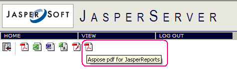

{} 

Integrating Aspose.PDF for JasperReports with JasperServer is described below. 

{} 

In following steps <InstallDir> stands for the JasperServer installation directory. 

1. Add the following new exporter properties to the **<InstallDir>\apache-tomcat\webapps\jasperserver\WEB-INF\flows\viewReportBeans.xml** file. 



 <bean id="AsposePdfExporter" class="com.aspose.pdf.jr3_7_0.jasperreports.AsposeServerPdfExporter" parent="baseReportExporter">

   <property name="exportParameters" ref="AsposeExportParameters"/>

   <property name="setResponseContentLength" value="true"/>

</bean>

<bean id="AsposePdfExporterConfiguration" class="com.jaspersoft.jasperserver.war.action.ExporterConfigurationBean">

   <property name="descriptionKey" value="Pdf - PDF via Aspose.PDF for JasperReports"/>

   <property name="iconSrc" value="/images/pdf.gif"/>

   <property name="parameterDialogName" value="dlg"/>

   <property name="exportParameters" ref="AsposeExportParameters"/>

   <property name="currentExporter" ref="AsposePdfExporter"/>

</bean>



1. Locate the <util:map id=”exporterConfigMap> element in the **<InstallDir>\apache-tomcat\webapps\jasperserver\WEB-INF\flows\viewReportBeans.xml** file and add the following lines: 



 <util:map id="exporterConfigMap">

   <entry key="pdf" value-ref="pdfExporterConfiguration"/>

   <entry key="xls" value-ref="xlsExporterConfiguration"/>

   <entry key="rtf" value-ref="rtfExporterConfiguration"/>

   <entry key="csv" value-ref="csvExporterConfiguration"/>

   <entry key="swf" value-ref="swfExporterConfiguration"/>

<!-- START of ADDED LINES -->

   <entry key="Aspose_pdf" value-ref="AsposePdfExporterConfiguration"/>

<!-- END of NEW LINES -->

</util:map>



1. Copy all GIF images from the \lib folder of **Aspose-pdf-jasperreports.zip** to <InstallDir>\apache-tomcat\webapps\jasperserver\images\.
1. Copy **Aspose-pdf-jasperreports.jar** from the \lib folder in the **Aspose.PDF.JasperReports.zip** to <InstallDir>\apache-tomcat\webapps\jasperserver\WEB-INF\lib\.
1. Add the following lines to the **<InstallDir>\apache-tomcat\webapps\jasperserver\WEB-INF\applicationContext.xml** file. 

   This bean may contain various configuration settings intended to configure the export. For example, you can use the JasperReports font mapping feature or specify the location of the Aspose.Cells for JasperReports license file. 



 <bean id="AsposeExportParameters" class="com.aspose.pdf.jr3_7_0.jasperreports.JrPdfExportParametersBean">

<property name="localizedFontMap" ref="localePdfFontMap"/>

<!-- Uncomment to apply a license. Check the license path.

<property name="licenseFile" value="C:/jasperserver-3.0/apache-tomcat/webapps/jasperserver/WEB-INF/Aspose.PDF.JasperReports.lic"/>

-->

</bean> 



1. Run JasperServer and open any report to view. If the previous steps were performed properly, you will see an icon for export via Aspose.PDF for JasperReports in the list of available formats. 

   **Aspose.PDF for JasperReports is integrated** 

