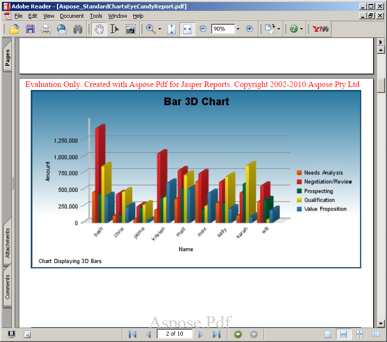
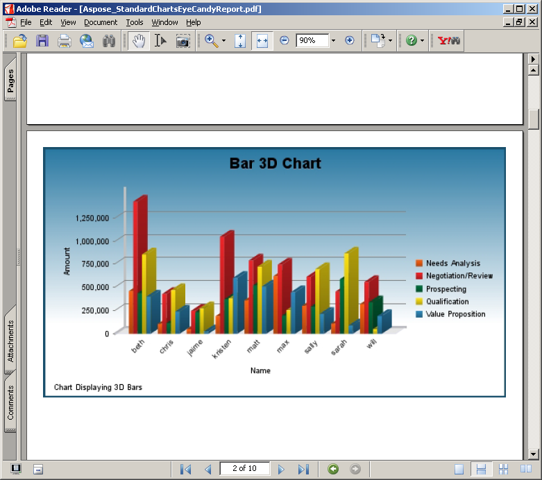

#### **Set the licenseFile Exporter Parameter in applicationContext.xml**
{} 

This method is used with JasperServer.

{} 

1. Download the license to your computer and copy it to the <InstallDir>\apache-tomcat\webapps\jasperserver\WEB-INF folder, where <InstallDir> stands for the JasperServer installation directory.
1. Locate the **<InstallDir>\apache-tomcat\webapps\jasperserver\WEB-INF\applicationContext.xml** file and add the following lines: 



 <bean id="AsposeExportParameters" class="comcom.aspose.pdf.jr3_7_0.jasperreports.JrPdfExportParametersBean">

    <property name="licenseFile" value="C:/jasperserver-pro-3.7.1/apache-tomcat/webapps/jasperserver-pro/WEB-INF/Aspose.Total.JasperReports.lic"/>

</bean> 



Note: Please note that installation path should not contain any spaces, for example C:/Program Files/JasperServer… as that causes problems when accessing the license file.
#### **Verify that License Works**
Export any report to PDF format and check if the report contains an evaluation message. If there is no evaluation message, then the license is working properly. 

**Aspose.PDF for JasperReports injects a watermark when working in evaluation mode** 

**Aspose.PDF for JasperReports injects a watermark when working in evaluation mode** 

