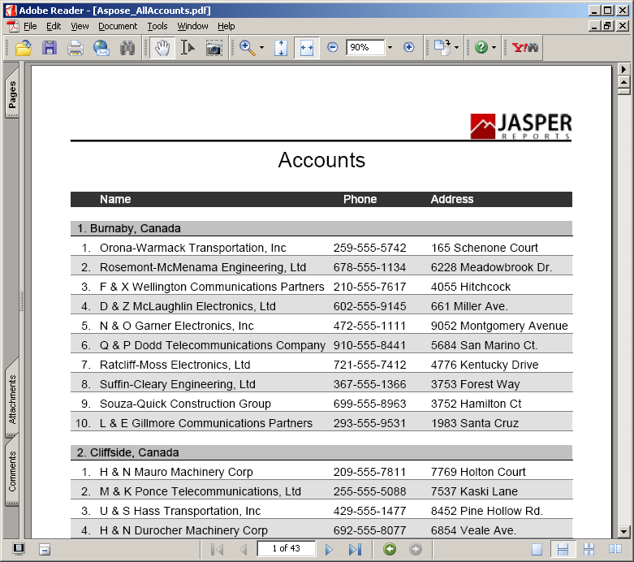
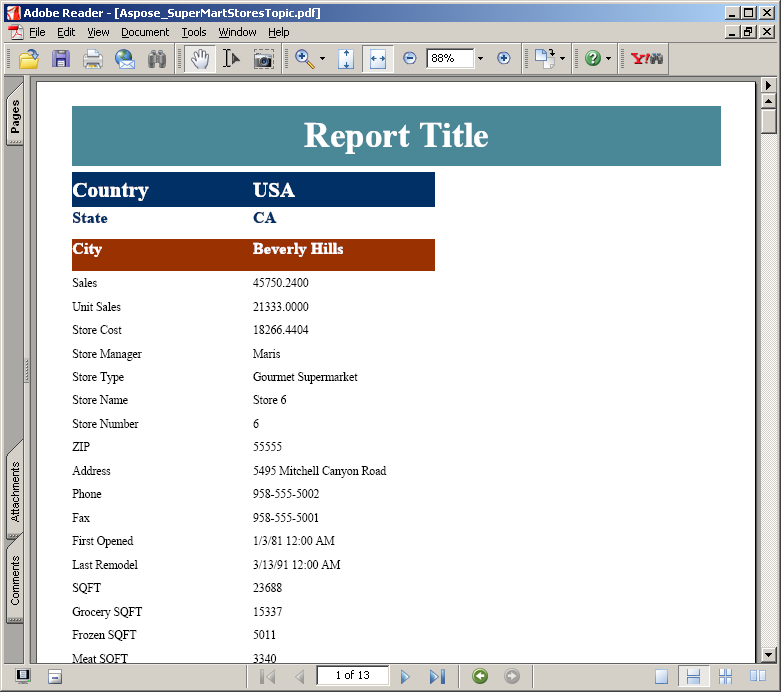
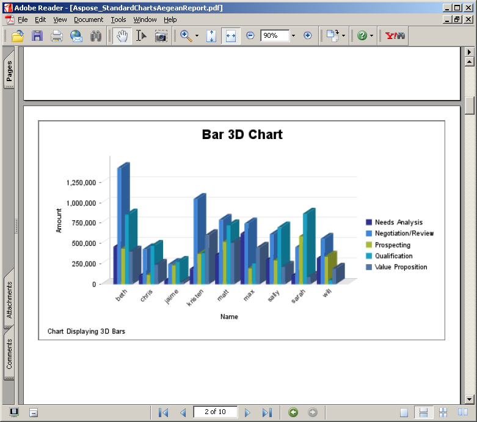
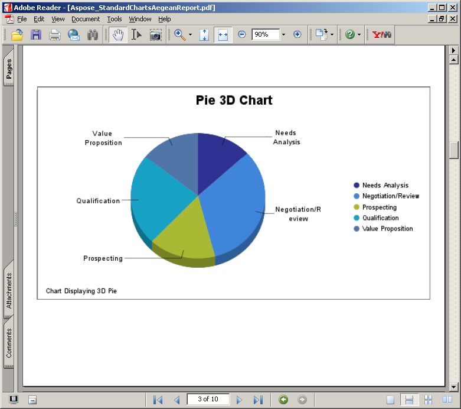
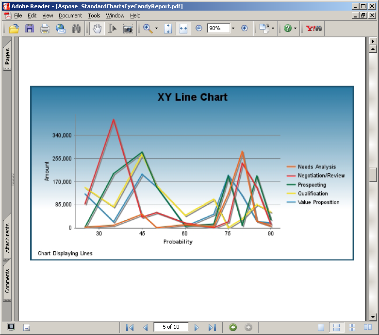
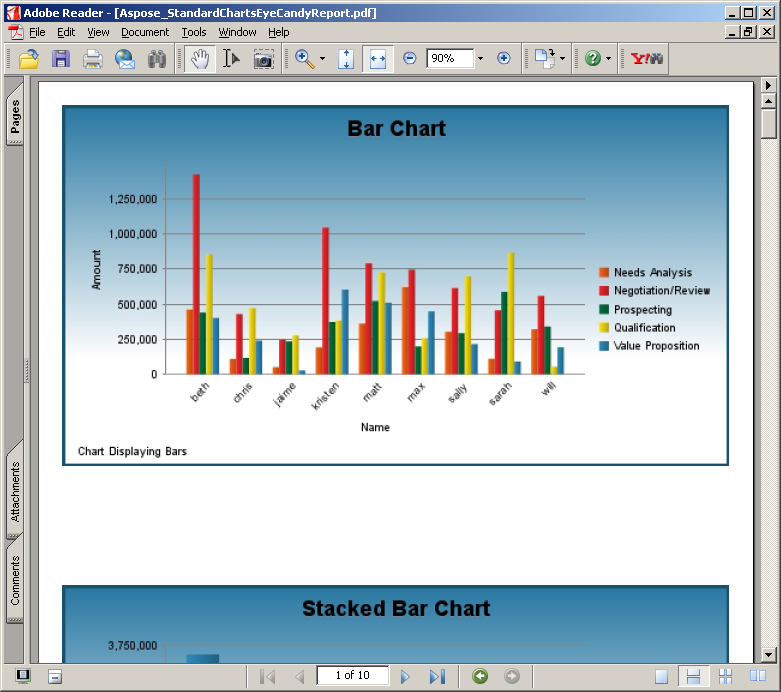
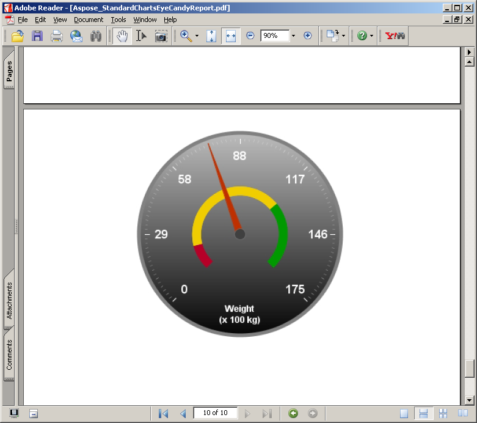
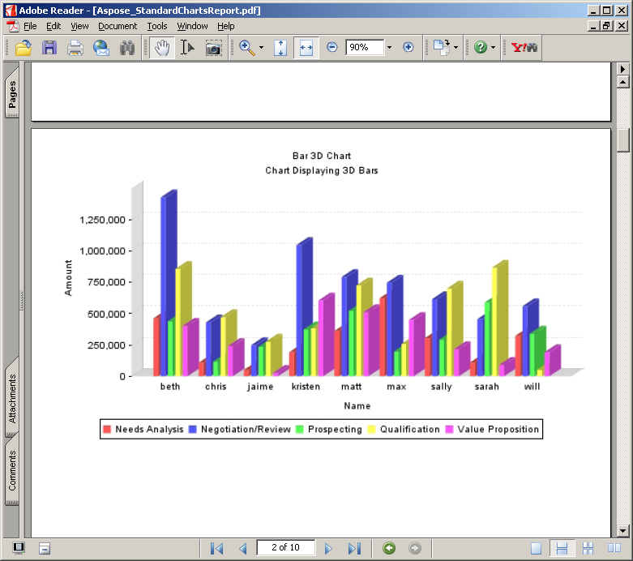
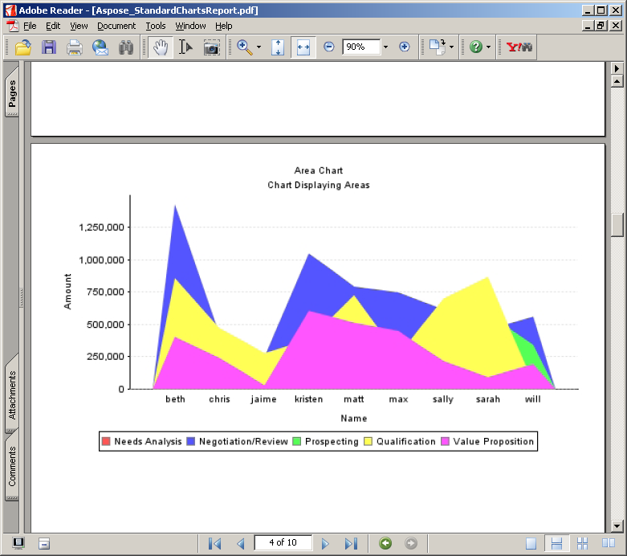

{} 

This gallery demonstrates PDF reports exported by Aspose.PDF for JasperReports. 

{} 

The reports shown below are based on sample data installed with JasperServer.

**All accounts report** 

**Supermart stores report** 

**Standard charts Aegean report** 

**Standard charts Aegean report** 

**Standard charts eye candy report** 

**Standard charts eye candy report** 

**Standard charts eye candy report** 

**Standard charts report** 

**Standard charts report** 

