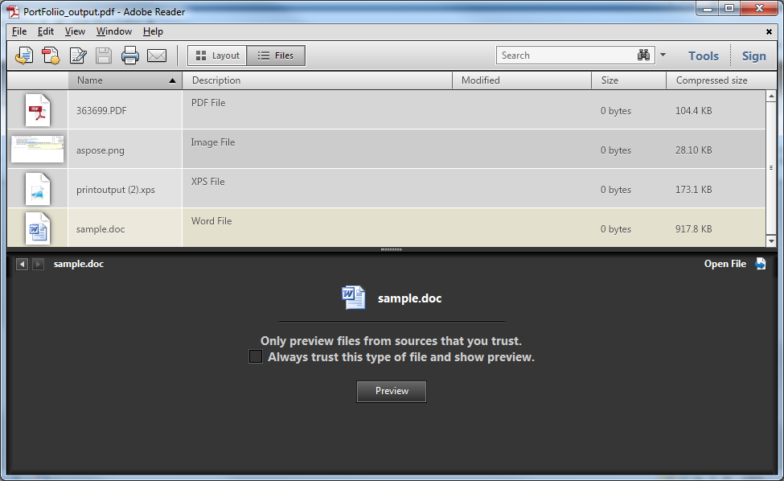

{} 

PDF portfolios allow you to bring together content from a variety of sources (for example, PDF, Word, Excel, JPEG files) into one unified container. The original files retain their individual identities but are assembled into a PDF portfolio file. Users can open, read, edit, and format each component file independently of the other component files.

Aspose.PDF for Java allows the creation of PDF Portfolio documents using the Document class. Load the individual file into a FileSpecification object and add them to the Document.Collection object using the add(...) method. Once the files have been added, use the Document class' save(..) method to generate the portfolio document.

{} 
#### **Code Sample**
The following example uses a Microsoft XPS File, a Word document, PDF and an image file to create a PDF Portfolio.

**A PDF portfolio created with Aspose.PDF**


