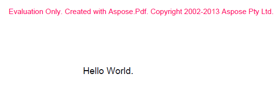

{} 

You can download Aspose.PDF for Android via Java for evaluation from [Aspose Repository](https://repository.aspose.com/webapp/#/artifacts/browse/tree/General/repo/com/aspose/aspose-pdf-android-via-java).

{} 

The evaluation download is the same as the licensed download. The evaluation version simply becomes a licensed version when a license is applied. The evaluation version of Aspose.PDF for Android via Java provides full product functionality, but inserts an evaluation watermark at the top of output documents.

**An evaluation message on a page**

****

If you want to test Aspose.PDF for Android via Java without the evaluation version limitations, you can [request a 30-day temporary license](https://purchase.aspose.com/temporary-license)
