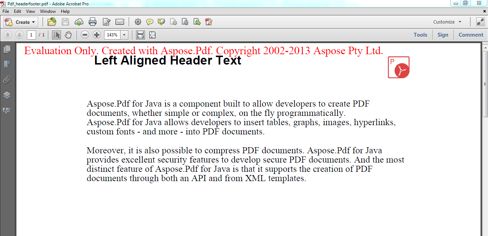

{} 

You can download [Aspose.PDF for Java](https://repository.aspose.com/webapp/#/artifacts/browse/tree/General/repo/com/aspose/aspose-pdf) for evaluation. The evaluation download is the same as the purchased download. The evaluation version simply becomes licensed when you add a few lines of code to [apply the license](/pdf/java/licensing/).

{} 

The evaluation version of Aspose.PDF provides full product functionality, but it has two limitations:

- It inserts an evaluation watermark.
- No more than four elements of any collection can be viewed/edited.

**A document showing the evaluation watermark**

If you want to test Aspose.PDF for Java without the evaluation version limitations, you can also request a 30-day Temporary License. Please refer to [How to get a Temporary License?](https://purchase.aspose.com/temporary-license)
