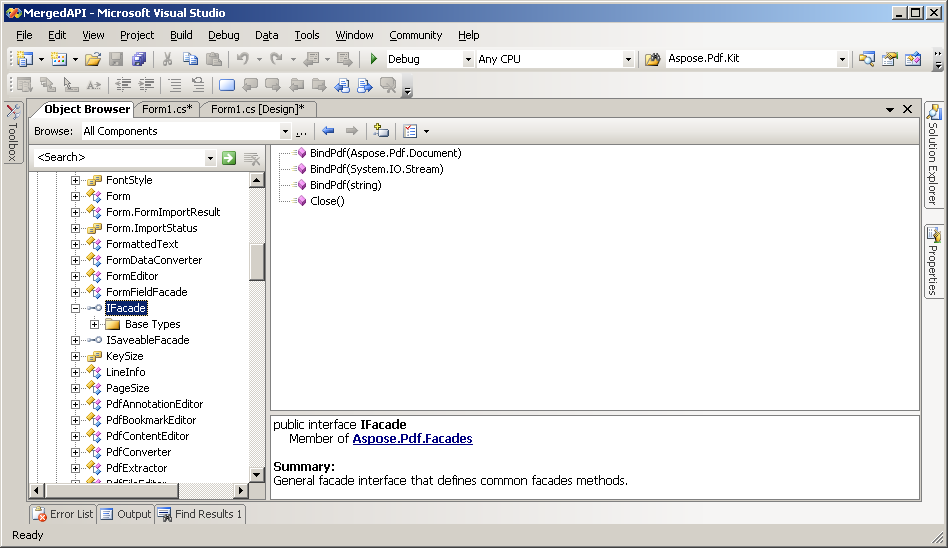
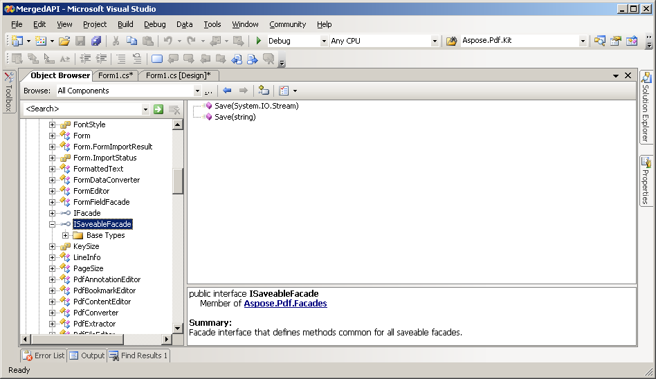

{} 

In order to have a unified approach to initialize the objects of classes present under Aspose.PDF.Facades namespace and in order to have a unified mechanism of releasing the resource occupied by these classes, we have made some changes and have introduced some new methods in these classes.

{} 
##### **Inherited from IFacade and ISaveableFacade interfaces**
All Facades (except PdfJavaStripper and PdfFileEditor) are inherited from IFacade interface:



 public interface IFacade : IDisposable

{

    void BindPdf(Aspose.PDF.Document srcDoc);

    void BindPdf(System.IO.Stream srcStream);

    void BindPdf(string srcFile);

    void Close();

}



This implies that:

- Only 2 facades (PdfJavaStripper and PdfFileEditor) do not support IFacade interface;
- All 16 facades have Close method for files releasing;
- All 16 facades support IDisposible interface.
- All 16 facades can be initialized and released uniformly.

All 12 Facades (except PdfViewer, PdfConverter, PdfExtractor, AutoFiller) support ISaveableFacade interface:



 public interface ISaveableFacade: IFacade

{

    void Save(string destFile);

    void Save(Stream destStream);

}



Also please note that since the release of Aspose.PDF for .NET 7.3.0, some Facade constructors and properties are marked as Obsolete and are not recommended to use. These Facades with obsolete entities include: PdfFileMend, PdfFileSecurity, PdfFileStamp, FormEditor, Form, AutoFiller, PdfFileInfo, PdfViewer.

{} 

- Its recommended to use BindPdf(..) method to load the input PDF file, rather than providing input file path information in Facade constructor.
- Its recommended to use Save(..) method to save the resultant/updated PDF file, rather than providing output file path information in Facade constructor.

{}
