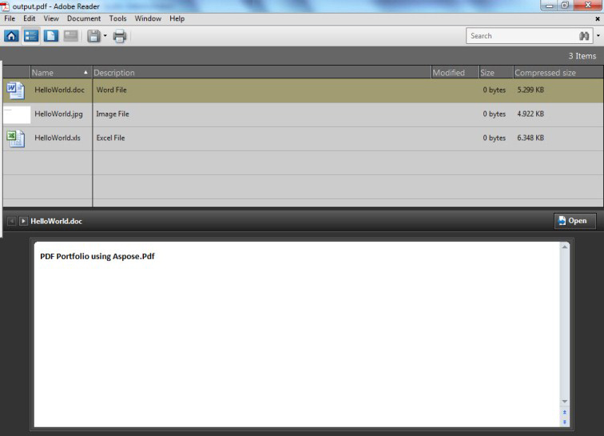

PDF Portfolios allow you to bring together content from a variety of sources (for example, PDF, Word, Excel, JPEG files) into one unified container. The original files retain their individual identities but are assembled into a PDF Portfolio file. Users can open, read, edit, and format each component file independently of the other component files.
## **How to Create a PDF Portfolio**
Aspose.PDF allows creating PDF Portfolio documents using the [Document](https://apireference.aspose.com/net/pdf/aspose.pdf/document) class. Add a file into a Document.Collection object after getting it with the [FileSpecification](https://apireference.aspose.com/net/pdf/aspose.pdf/filespecification) class. When the files have been added, use the Document class' Save method to save the portfolio document.

The following example uses a Microsoft Excel File, a Word document and an image file to create a PDF Portfolio.

The code below results in the following portfolio.

**A PDF Portfolio created with Aspose.PDF** 


## **Extract files from PDF Portfolio**
PDF Portfolios allow you to bring together content from a variety of sources (for example, PDF, Word, Excel, JPEG files) into one unified container. The original files retain their individual identities but are assembled into a PDF Portfolio file. Users can open, read, edit, and format each component file independently of the other component files.

Aspose.PDF allows the creation of PDF Portfolio documents using [Document](https://apireference.aspose.com/net/pdf/aspose.pdf/document) class. It also offers the capability to extract files from PDF portfolio.

The following image shows a sample PDF Portfolio.

The following code snippet shows you the steps to extract files from PDF portfolio.


## **Remove Files from PDF Portfolio**
In order to delete/remove files from PDF portfolio, try using the following code lines.


