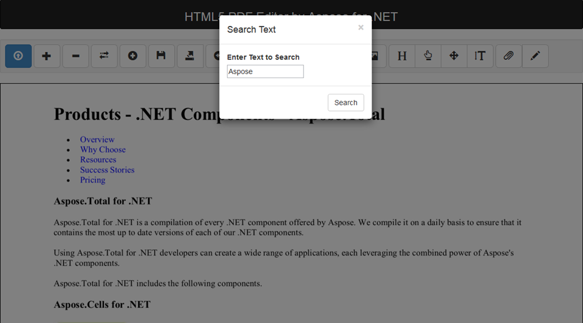

**Table of Contents**

- [Inserting Text in PDF File](#PDFEditor-WorkingwithText-InsertingTextinPDFFile) 
  - Editor.js
  - CanvasSave.aspx.cs
- [Highlight Text in PDF File](#PDFEditor-WorkingwithText-HighlightTextinPDFFile) 
  - Editor.js
  - CanvasSave.aspx.cs
- [Searching Text in PDF File](#PDFEditor-WorkingwithText-SearchingTextinPDFFile) 
  - Editor.js
  - CanvasSave.aspx.cs
- [Replacing Text in PDF File](#PDFEditor-WorkingwithText-ReplacingTextinPDFFile) 
  - Editor.js
  - CanvasSave.aspx.cs
### **Inserting Text in PDF File**
Using Html5 PDF Editor, you can insert text in PDF files using **Text Mode** option from the menu bar. Once you select the **Text Mode** menu item and click on any location on the editor where you want to add the text, you are presented with an input dialog to input and format your desired text as shown below:

In our next section, we will discuss the technical details behind this feature.

**How it works?**

**HTML - "Text Mode" menu item is selected on the page**

When you select "Text Mode" menu item and click your desired location on the editor to insert text in PDF file, input dialog is shown to get the text you need to insert on the page. After providing the text and pressing "OK" button, "saveTextFromArea" method is called in *Editor.js* file.

**Javascript - Get the input text from input dialog and show on the editor.**

See *Editor.js* tab below for source code of saveTextFromArea method, which gets the text from the input dialog and show it on the editor. Also, it saves the data in shapes collection which is later used on server side to insert text in the PDF file. You can check the source code of saveFile method which is called when the file is saved.

**ASP.NET web method handles server requests**

As mentioned above, the text will actually get inserted into our source PDF file when we perform the save operation which uses GetTextStamp method to create the text stamp to insert in PDF file. See *Canvas.aspx.cs* tab below with source code of GetTextStamp method. It uses Aspose.PDF.TextStamp class to insert the text in the PDF file.
#### **Editor.js**


 function saveTextFromArea() {

    //get the value of the textarea

    var text = $('#textareaTest').val();

    $('#textAreaPopUp').css('visibility', 'hidden');

    if (text != "") {

        r = 0;

        var canvas = document.getElementById('imageView');

        var ctx = canvas.getContext('2d');

        if (editText == -1) {

            //set the font styles

            ctx.fillStyle = fontColor;

            //draw the text

            ctx.font = fontStyle + " " + fontWieght + " " + fontSize + "px " + fontText;

            ctx.fillText(text, textX, textY + parseInt(fontSize));

            tempShape = { x: textX, y: textY, w: ctx.measureText(text).width, h: parseInt(fontSize), p: currentPage, f: Npages[currentPage - 1], t: text, n: fontText, s: fontSize, c: fontColor, wt: fontWieght, st: fontStyle, ratio: aRatio[currentPage - 1], imfile: "", imName: "", Itype: "text", fieldType: r };

            shapes.push(tempShape);

        }

        else {

            shapes[editText].t = text;

            shapes[editText].wt = fontWieght;

            shapes[editText].s = fontSize;

            shapes[editText].n = fontText;

            shapes[editText].st = fontStyle;

            shapes[editText].c = fontColor;

            shapes[editText].h = parseInt(fontSize);

            drawScreen();

            DrawShapes();

            shapes[editText].w = ctx.measureText(text).width;

        }

        ctx.save();

        ctx.restore();

    }

}

function saveFile() {

    $('#loadingModal').modal('show');

    var filename = 'image'.concat(currentPage).concat('.png');

    shapes2 = [];

    for (var i = 0; i < shapes.length; i++) {

        tempShape = { x: shapes[i].x, y: shapes[i].y, w: shapes[i].w, h: shapes[i].h, p: shapes[i].p, f: shapes[i].f, t: shapes[i].t, n: shapes[i].n, s: shapes[i].s, c: shapes[i].c, wt: shapes[i].wt, st: shapes[i].st, ratio: shapes[i].ratio, imfile: "", imName: shapes[i].imName, Itype: shapes[i].Itype, fieldType: shapes[i].fieldType };

        shapes2.push(tempShape);

    }

    wholedata = JSON.stringify({ 'shapes': shapes2, 'filename': filename, 'aspectRatio': ratio.toString() });

    // Sending the image data to Server

    $.ajax({

        type: 'POST',

        url: 'CanvasSave.aspx/SaveFile',

        data: wholedata,

        contentType: 'application/json; charset=utf-8',

        dataType: 'json',

        success: function (data, textStatus, jqXHR) { $('#loadingModal').modal('hide'); alert('File Saved'); },

        //call on ajax call failure

        error: function (xhr, textStatus, error) {

            $('#loadingModal').modal('hide');

            //called on ajax call success

            alert("Error: " + xhr.responseJSON.Message);

        }

    });

}


#### **CanvasSave.aspx.cs**


 /// 

        /// Get Text Stamp to be added in PDF file

        /// 

        /// <param name="shapes"></param>

        /// <param name="shapeX"></param>

        /// <param name="yaxis"></param>

        /// <returns></returns>

        private static TextStamp GetTextStamp(shap shape, float shapeX, double yaxis)

        {

            //create text stamp

            TextStamp textStamp = new TextStamp(shape.t);

            //set origin

            textStamp.XIndent = (float)(shapeX);

            textStamp.YIndent = (float)(yaxis);

            //rotate stamp

            textStamp.RotateAngle = 360 - ((Convert.ToDouble(shape.fieldType)) * 180 / Math.PI);

            //set text properties

            textStamp.TextState.Font = FontRepository.FindFont(shape.n);

            textStamp.TextState.FontSize = Convert.ToInt32(shape.s) * 0.75f;

            if (shape.wt == "bold")

            {

                textStamp.TextState.FontStyle = FontStyles.Bold;

            }

            if (shape.st == "italic")

            {

                textStamp.TextState.FontStyle = FontStyles.Italic;

            }

            textStamp.TextState.ForegroundColor = GetColor(shape.c);

            return textStamp;

        }


### **Highlight Text in PDF File**
Using Html5 PDF Editor, you can highlight text in PDF files using **Highlight Mode** option from the menu bar. Once you select the **Highlight Mode** menu item, you can highlight any text and area using the rectangular highlighting tool. In our next section, we will discuss the technical details behind this feature.

**How it works?**

**HTML - "Highlight Mode" menu item is selected on the page**

When you select "Highlight Mode" menu item, you can draw a rectangular highlight around any text or item in your PDF file. The implementation of this process can be seen in "tools.rect" method in *Editor.js* file.

**Javascript - Draw highlighting rectangle on the editor.**

See *Editor.js* tab below for source code of tool.rect method, which allows the user to draw highlighting rectangle at any location on the editor. Also, it saves the data in shapes collection which is later used on server side to insert highlighting in source PDF file. You can check the source code of saveFile method which is called when the file is saved.

**ASP.NET web method handles server requests**

As mentioned above, the highlighting is actually inserted into our source PDF file when we perform the save operation which uses GetImageStamp method to insert the image stamp in source PDF file at the location specified on editor. See *Canvas.aspx.cs* tab below with source code of GetImageStamp method. It uses Aspose.PDF.ImageStamp class to insert the highlighting rectangle in the PDF file.
#### **Editor.js**


 // The rectangle tool.

        tools.rect = function () {

            var tool = this;

            this.started = false;

            this.mousedown = function (ev) {

                if (myTools == 'Rect') {

                    tool.started = true;

                    tool.x0 = ev._x;

                    tool.y0 = ev._y;

                }

            };

            this.mousemove = function (ev) {

                if (!tool.started) {

                    return;

                }

                var x = Math.min(ev._x, tool.x0),

          y = Math.min(ev._y, tool.y0),

          w = Math.abs(ev._x - tool.x0),

          h = Math.abs(ev._y - tool.y0);

                context.clearRect(0, 0, canvas.width, canvas.height);

                if (!w || !h) {

                    return;

                }

                context.fillStyle = 'rgba(255, 230, 81, 0.5)';

                context.fillRect(x, y, w, h);

                tempX = x;

                tempY = y;

                tempW = w;

                tempH = h;

                numShapes = numShapes + 1;

            };

            this.mouseup = function (ev) {

                if (tool.started) {

                    tool.mousemove(ev);

                    tool.started = false;

                    img_update();

                    tempShape = { x: tempX, y: tempY, w: tempW, h: tempH, p: currentPage, f: Npages[currentPage - 1], t: "", n: "", s: "", c: "", wt: "", st: "", ratio: aRatio[currentPage - 1], imfile: "", imName: "", Itype: "highlight", fieldType: "" };

                    shapes.push(tempShape);

                }

            };

        };

function saveFile() {

    $('#loadingModal').modal('show');

    var filename = 'image'.concat(currentPage).concat('.png');

    shapes2 = [];

    for (var i = 0; i < shapes.length; i++) {

        tempShape = { x: shapes[i].x, y: shapes[i].y, w: shapes[i].w, h: shapes[i].h, p: shapes[i].p, f: shapes[i].f, t: shapes[i].t, n: shapes[i].n, s: shapes[i].s, c: shapes[i].c, wt: shapes[i].wt, st: shapes[i].st, ratio: shapes[i].ratio, imfile: "", imName: shapes[i].imName, Itype: shapes[i].Itype, fieldType: shapes[i].fieldType };

        shapes2.push(tempShape);

    }

    wholedata = JSON.stringify({ 'shapes': shapes2, 'filename': filename, 'aspectRatio': ratio.toString() });

    // Sending the image data to Server

    $.ajax({

        type: 'POST',

        url: 'CanvasSave.aspx/SaveFile',

        data: wholedata,

        contentType: 'application/json; charset=utf-8',

        dataType: 'json',

        success: function (data, textStatus, jqXHR) { $('#loadingModal').modal('hide'); alert('File Saved'); },

        //call on ajax call failure

        error: function (xhr, textStatus, error) {

            $('#loadingModal').modal('hide');

            //called on ajax call success

            alert("Error: " + xhr.responseJSON.Message);

        }

    });

}


#### **CanvasSave.aspx.cs**


 /// 

        /// Get Image Stamp for adding images and highlights

        /// 

        /// <param name="shapeX"></param>

        /// <param name="yaxis"></param>

        /// <param name="shape"></param>

        /// <param name="shapeH"></param>

        /// <param name="shapeW"></param>

        /// <returns></returns>

        private static ImageStamp GetImageStamp(float shapeX, double yaxis, shap shape, double shapeH, double shapeW)

        {

            ImageStamp imageStamp;

            if (shape.Itype == "highlight")

            {

                imageStamp = new ImageStamp(HttpContext.Current.Server.MapPath("test.png"));

            }

            else

            {

                imageStamp = new ImageStamp(HttpContext.Current.Server.MapPath("Images/" + shape.imName));

            }

            imageStamp.Background = false;

            imageStamp.XIndent = (float)(shapeX);

            imageStamp.YIndent = (float)(yaxis);

            imageStamp.Height = shapeH;

            imageStamp.Width = shapeW;

            return imageStamp;

        }


### **Searching Text in PDF File**
Using Html5 PDF Editor, you can search text in PDF files using **Search Text** option from the menu bar. Once you click the **Search Text** menu item, you will be presented with a dialog box to input the text to be searched as shown below:

On providing the text and pressing search, all the instances of the word searched will get highlighted as shown below:

**How it works?**

**HTML - "Search Text" menu item is clicked on the page**

When you click "Search Text" menu item, you are presented with an input dialog to enter the text you want to search. After entering the text and pressing search button, "Move" method is called which checks whether the move page operation is performed or search operation is performed and then it calls performSearch method in *Editor.js* file.

**jQuery - Send Ajax server request for method SearchData method**

See *Editor.js* tab below for source code of performSearch method, which gets the input text and a request to server method SearchData in _CanvasSave.aspx.cs_ file.

**ASP.NET web method handles server requests**

See _Canvas.aspx.cs_ tab below. Using the input text passed from performSearch method, SearchData method uses Aspose.PDF.Text.TextFragmentAbsorber class to search for all the instances of the input text in our source PDF file and System.Drawing.Brush class to draw highlighting against the searched text. Once the data is searched, the resultant file is again converted to image and gets loaded in the editor.
#### **Editor.js**


 function performSearch() {

        //Get the value of the new location of the page

        var moveTo = $("#txtMove").val();

        $('#loadingModal').modal('show');

        //collect data regarding searching of text

        movedata = JSON.stringify({ 'searchText': moveTo, 'pageList': Npages });

        // Sending the data to Server

        $.ajax({

            type: 'POST',

            url: 'CanvasSave.aspx/SearchData',

            data: movedata,

            contentType: 'application/json; charset=utf-8',

            dataType: 'json',

            success: function (data, textStatus, jqXHR) {

                searchFolder = data.d;

                AfterSearch();

                $('#loadingModal').modal('hide');

            },

            //call on ajax call failure

            error: function (xhr, textStatus, error) {

                $('#loadingModal').modal('hide');

                //called on ajax call success

                alert("Error: " + xhr.responseJSON.Message);

            }

        });

    }


#### **CanvasSave.aspx.cs**


 public static string SearchData(string searchText, string[] pageList)

        {

            string name = DateTime.Now.Millisecond.ToString();

            System.IO.DirectoryInfo downloadedMessageInfo = new DirectoryInfo(HttpContext.Current.Server.MapPath("search/"));

            foreach (FileInfo file in downloadedMessageInfo.GetFiles())

            {

                file.Delete();

            }

            foreach (DirectoryInfo dir in downloadedMessageInfo.GetDirectories())

            {

                dir.Delete(true);

            }

            System.IO.Directory.CreateDirectory(HttpContext.Current.Server.MapPath("search/" + name));

            Document doc = new Document(HttpContext.Current.Server.MapPath("Convert/output.pdf"));

                for (int i = 1; i <= doc.Pages.Count; i++)

                {

                    string filename = "Input/" + pageList[i-1];

                    filename = filename.Replace("image", "image-1");

                    Bitmap bmp = (Bitmap)Bitmap.FromFile(HttpContext.Current.Server.MapPath(filename));

                    using (System.Drawing.Graphics gr = System.Drawing.Graphics.FromImage(bmp))

                    {

                        float scale = 150 / 72f;

                        gr.Transform = new System.Drawing.Drawing2D.Matrix(scale, 0, 0, -scale, 0, bmp.Height);

                        Aspose.PDF.Page page = doc.Pages[i];

                        //create TextAbsorber object to find all words

                        TextFragmentAbsorber textFragmentAbsorber = new TextFragmentAbsorber(searchText);

                        //   textFragmentAbsorber.TextSearchOptions.IsRegularExpressionUsed = true;

                        page.Accept(textFragmentAbsorber);

                        //get the extracted text fragments

                        TextFragmentCollection textFragmentCollection = textFragmentAbsorber.TextFragments;

                        Brush brush = new SolidBrush(System.Drawing.Color.FromArgb(50, 255, 255, 0));

                        //loop through the fragments

                        foreach (TextFragment textFragment in textFragmentCollection)

                        {

                            //  if (i == 0)

                            {

                                gr.FillRectangle(

                                    //   gr.DrawRectangle(

                                brush,

                                (float)(textFragment.Position.XIndent),

                                (float)(textFragment.Position.YIndent),

                                (float)(textFragment.Rectangle.Width),

                                (float)(textFragment.Rectangle.Height));

                                for (int segNum = 1; segNum <= textFragment.Segments.Count; segNum++)

                                {

                                    TextSegment segment = textFragment.Segments[segNum];

                                    gr.DrawRectangle(

                                    Pens.Green,

                                    (float)segment.Rectangle.LLX,

                                    (float)segment.Rectangle.LLY,

                                    (float)segment.Rectangle.Width,

                                    (float)segment.Rectangle.Height);

                                }

                            }

                        }

                        gr.Dispose();

                    }

                    bmp.Save(HttpContext.Current.Server.MapPath(filename.Replace("image-1","image_search")), System.Drawing.Imaging.ImageFormat.Png);

                    bmp.Dispose();

                    string height = "";

                    string Aratio = "";

                    System.Drawing.Image image = System.Drawing.Image.FromFile(HttpContext.Current.Server.MapPath(filename.Replace("image-1", "image_search")));

                    ScaleImage(image, 1138, 760, HttpContext.Current.Server.MapPath("search/" + name + "/" + pageList[i - 1]), out height, out Aratio);

                    image.Dispose();

                  //  System.IO.File.Copy(HttpContext.Current.Server.MapPath("Input/image_search" + i + ".png"), HttpContext.Current.Server.MapPath("Input/image" + i + ".png"));

                }

                return name;

        }


### **Replacing Text in PDF File**
Using Html5 PDF Editor, you can replace the existing text in PDF files using **Replace Text** option from the menu bar. Once you click the **Replace Text** menu item, you will be presented with a dialog box to input the text to be searched and replaced with.

**How it works?**

**HTML - "Replace Text" menu item is clicked on the page**

When you click "Replace Text" menu item, you are presented with an input dialog to enter the text to search and replace. After entering the text and pressing Replace button, "ReplaceText" method is called in *Editor.js* file.

**jQuery - Send Ajax server request for method ReplaceText method**

See *Editor.js* tab below for source code of ReplaceText method, which gets the input text from input text dialog and a request to server method ReplaceText in *CanvasSave.aspx.cs* file.

**ASP.NET web method handles server requests**

See *Canvas.aspx.cs* tab below. ReplaceText method uses Aspose.PDF.Text.TextFragmentAbsorber class to search for all the instances of the text to be replaced in our source PDF file and replaces all the instances with the replaced text. Once the text is replaced, the resultant file is again converted to image and gets loaded in the editor.
#### **Editor.js**


 function ReplaceText() {

    var txtFind = $("#txtFind").val();

    var txtReplace = $("#txtReplace").val();

    var movedata = JSON.stringify({ 'txtFind': txtFind, 'txtReplace': txtReplace, 'pageList': Npages });

    $('#loadingModal').modal('show');

    // Sending the image data to Server

    $.ajax({

        type: 'POST',

        url: 'CanvasSave.aspx/ReplaceText',

        data: movedata,

        contentType: 'application/json; charset=utf-8',

        dataType: 'json',

        success: function (data, textStatus, jqXHR) { AfterSearch();  $('#loadingModal').modal('hide'); },

        //call on ajax call failure

        error: function (xhr, textStatus, error) {

            $('#loadingModal').modal('hide');

            //called on ajax call success

            alert("Error: " + xhr.responseJSON.Message);

        }

    });

}


#### **CanvasSave.aspx.cs**


 public static string ReplaceText(string txtFind, string txtReplace, string[] pageList)

        {

            try

            {

                Document doc = new Document(HttpContext.Current.Server.MapPath("Convert/output.pdf"));

                //create TextAbsorber object to find all instances of the input search phrase

                TextFragmentAbsorber textFragmentAbsorber = new TextFragmentAbsorber("(?i)" + txtFind, new Aspose.PDF.Text.TextOptions.TextSearchOptions(true));

                textFragmentAbsorber.TextReplaceOptions.ReplaceAdjustmentAction = TextReplaceOptions.ReplaceAdjustment.WholeWordsHyphenation;

                //accept the absorber for all the pages

                doc.Pages.Accept(textFragmentAbsorber);

                //get the extracted text fragments

                TextFragmentCollection textFragmentCollection = textFragmentAbsorber.TextFragments;

                //loop through the fragments

                foreach (TextFragment textFragment in textFragmentCollection)

                {

                    //update text and other properties

                    textFragment.Text = txtReplace;

                }

                doc.Save(HttpContext.Current.Server.MapPath("Convert/output.pdf"));

                doc = new Document(HttpContext.Current.Server.MapPath("Convert/output.pdf"));

                System.IO.DirectoryInfo downloadedMessageInfo = new DirectoryInfo(HttpContext.Current.Server.MapPath("Input/"));

                foreach (FileInfo file in downloadedMessageInfo.GetFiles())

                {

                    file.Delete();

                }

                for (int pageCount = 1; pageCount <= doc.Pages.Count; pageCount++)

                {

                    string filename = "Input/" + pageList[pageCount - 1];

                    filename = filename.Replace("image", "image-1");

                    using (FileStream imageStream = new FileStream(HttpContext.Current.Server.MapPath(filename), FileMode.Create))

                    {

                        //Create Resolution object

                        Resolution resolution = new Resolution(300);

                        //create PNG device with specified attributes

                        PngDevice pngDevice = new PngDevice();

                        //Convert a particular page and save the image to stream

                        pngDevice.Process(doc.Pages[pageCount], imageStream);

                        //Close stream

                        imageStream.Close();

                        System.Drawing.Image image = System.Drawing.Image.FromFile(HttpContext.Current.Server.MapPath(filename));

                        string height = "";

                        string Aratio = "";

                        ScaleImage(image, 1138, 760, HttpContext.Current.Server.MapPath(filename.Replace("image-1", "image")), out height, out Aratio);

                        image.Dispose();

                    }

                }

            }

            catch (Exception exp)

            {

            }

            return "success";

        }


