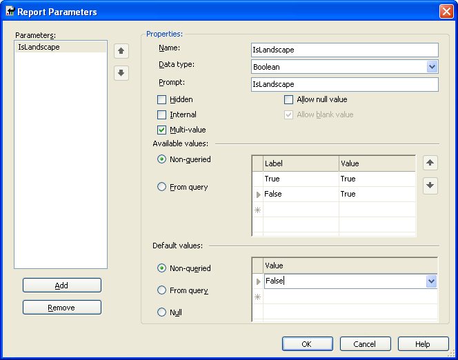
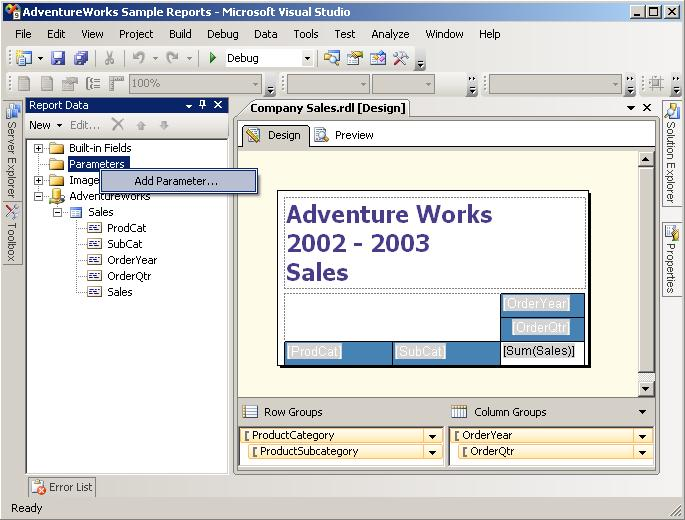

{} 

You can specify certain configuration parameters that affect how Aspose.Pdf for Reporting Services generates documents. This section describes this process.

{} 

To configure Aspose.Pdf for Reporting Services, you need to edit the C:\Program Files\Microsoft SQL Server\<Instance>\Reporting Services\ReportServer\rsreportserver.config file. This is an XML file and the renderer configuration is inside the <Extension> element corresponding to the Aspose.PDF renderer.

**Example**



 <Render>

...

<Extension Name="APPDF" Type=" Aspose.PDF.ReportingServices.Renderer,Aspose.PDF.ReportingServices ">

<!--Insert configuration elements for exporting to PDF here. The following is an example

For PageOrientation -->

<Configuration>

<IsLandscape>True</IsLandscape>

</Configuration>

</Extension>

</Render>



If you want to make the parameters for specific report file but not for all the reports, you can add report parameter for the specific report by the report builder as the following steps (for the 'IsLandscape' example):

1. Open the report in Report Designer and then open the menu 'Report', select the menu item 'report parameters'.
1. In the report parameter dialog, click button 'Add' to add the parameter named 'IsLandscape', with the type of Boolean and the value should be True. 

Figure for Report Builder Designer 2005. 

Figure for Report Builder Designer 2008.
