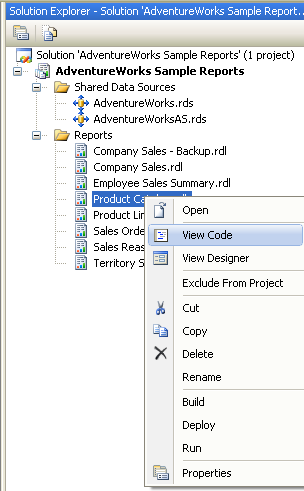

{} 

You can add custom properties for some report items to expand their usage, such as ToC, line arrows and so on. This section describes this process.

{} 

To add custom properties, you need to edit the code file of RDL document as the following steps:

1. As the following figure, open your project, change to solution explorer, and right click on the selected report file, then select the 'View Code' menu item. 

1. Edit the code file with XML-format style. For example, we want to add a custom property for chart report item. The following code with red font color style should be added. 

**Example**



 <chart Name="chart1">

    <Left>5.5cm</Left>

    <Top>0.5cm</Top>

      ......

    

    <CustomProperties>

      <CustomProperty>

        <Name>IsInList</Name>

        <Value>True</Value>

      </CustomProperty>

    </CustomProperties>

</chart> 



In the code fragment, the property name is IsInList with the value 'True'.

This chapter is not applicable for Aspose.PDF for Reporting Services 2000, because SSRS2000 does NOT support adding custom properties for report items
