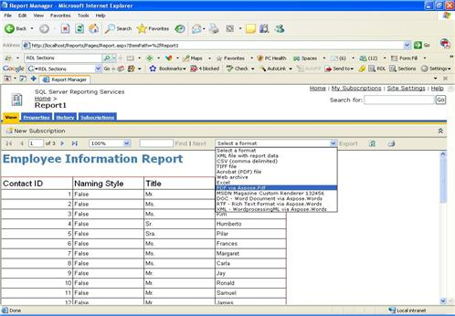
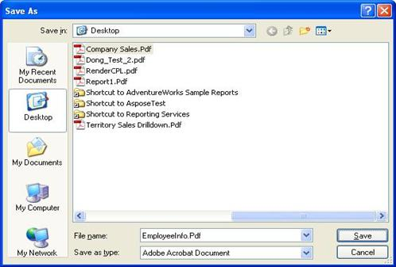

{} 

You only need to follow these steps if you install Aspose.PDF for Reporting Services manually, not using the MSI installer. MSI installer performs all necessary installation and registration actions automatically.

{} 

In the following steps, you will need to copy and modify files in the directory where Microsoft SQL Server Reporting Services is installed. The SSRS 2000 assembly is located in the Bin\SSRS2000 directory of the zip package; the SSRS 2005 assembly is located in the Bin\SSRS2005 directory; the SSRS 2008 assembly is located in the Bin\SSRS2008 directory. 

**Step 1.** Locate the Report Server installation directory. The root directory for Microsoft SQL Server is usually C:\Program Files\Microsoft SQL Server. Further process is slightly different for Reporting Services 2000, 2005 and 2008:

- Report Server 2000 is installed in the C:\Program Files\Microsoft SQL Server\MSSQL\Reporting Services\ReportServer directory.
- There could be several instances of Microsoft SQL Server 2005 configured on the machine and they will occupy several MSSQL.x subdirectories such as MSSQL.1, MSSQL.2 and so on. You will need to find the correct C:\Program Files\Microsoft SQL Server\MSSQL.x\Reporting Services\ReportServer directory before you proceed with the following steps.
- Report Server 2008 is installed in the C:\Program Files\Microsoft SQL Server\ MSRS10.MSSQLSERVER\Reporting Services\ReportServer directory.

To describe the following steps clearly, All of the three different directories will be used as *<Instance>*.

**Step 2.** Copy Aspose.PDF.ReportingServices.dll to *<Instance>* \bin folder.

**Step 3.** Register Aspose.PDF for Reporting Services as a rendering extension. To do this, open *<Instance>*\rsreportserver.config and add the following lines into the <Render> element:

**Example**



 <Render>

...

<!--Start here.-->

<Extension Name="APPDF" Type="Aspose.PDF.ReportingServices.Renderer,Aspose.PDF.ReportingServices"/>

</Render>



**Step 4.** Give Aspose.PDF for Reporting Services permissions to execute. To do this, open *<Instance>*\rssrvpolicy.config and add the following as the last item in the second to outer <CodeGroup> element (which should be <CodeGroup class="FirstMatchCodeGroup" version="1" PermissionSetName="Execution" Description="This code group grants MyComputer code Execution permission.">):

**Example**



 <CodeGroup>

...

<CodeGroup>

...

<!--Start here.-->

<CodeGroup class="UnionCodeGroup" version="1" PermissionSetName="FullTrust"

Name="Aspose.PDF_for_Reporting_Services" Description="This code group grants full trust to the AP4SSRS assembly.">

<IMembershipCondition class="StrongNameMembershipCondition" version="1" PublicKeyBlob="00240000048000009400000006020000002400005253413100040000010001000734cc24bfcebd7aa8c6e2bf8af5c2b95c7a7e6092abb60d68a7d9efde285cf7dce7f354b44cf3064e8ad85bddfe405ad1e51855d9a1367c15cb34529988feeee0c3279caecdb6dfd7f94c5364d2bd282c4f93493d56d33df36f97da8fd71bb7dc4b0e7f1428b926291cdea7cec1085aa9cc0f6771e4fc2f5772603eee3afaaa" />

</CodeGroup>

<!--End here. -->

</CodeGroup>

</CodeGroup>



**Step 5.** Verify that Aspose.PDF for Reporting Services was installed successfully. To do that, open Report Manager and check the list of available export types for a report. You can launch Report Manager by opening a browser (Microsoft Internet Explorer 6.0 or later) and typing the Report Manager URL in the address bar (by default it is http://<ComputerName>/Reports). Select one of the reports you have in your server and open the Select Format combo box. You should see the list of export formats provided by Aspose.PDF for Reporting Services. Select PDF via Aspose.PDF. 

Click on the Export link. It will generate the report in the selected format, send to the client and open in save dialog: 

Congratulations, you have successfully installed Aspose.PDF for Reporting Services and generated a report as a PDF document!
