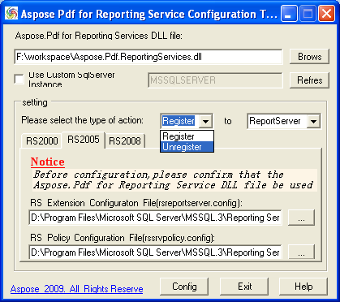

{} 

Aspose Pdf for Reporting Service Config uring to ol can help you to config the 'Aspose.PDF for ReportingServices.dll' file for Report Server(RS) and VisualStudio(VS) products. Currently it supports RS2000, RS2005, RS2008, VS2005 and VS2008.

{} 

If you wan t to register the DLL file, the 'Register' action type should be selected. And 'Unregister' action type should be used for unregistering. 

**The following steps describe how to use it in detail:**

1. Input or browse the path of the DLL file for Aspose Pdf for Reporting Service;
1. Select the corresponding action type: register or unregister;
1. Select the corresponding product: ReportServer or VS Design tool;
1. In the tab pages, select the version of the current product you want to configure. In this step, it is necessary for you to check the DLL file be suitable for the current version. If the current version of this product is not installed on your machine, the configuration tool will inform you with tips. If you are configuring for RS and the name of MS SQLServer instance is not 'MSSQLSERVER', please input the custom instance name, then press refresh button.
1. Make sure that the configure file’s path and name showed in the textbox be correct. If not, you can press the button to look it up manually.
1. Press 'Config' button. After several seconds, it will inform you the result of configuration, successful or failed.
