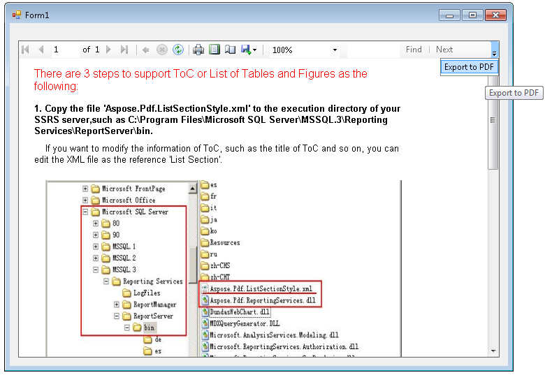

{} 

This page demonstrates how to export report from ReportViewer 2010 or ReportViewer 2012 to PDF format using Aspose.PDF for Reporting Services.

{} 

RplRenderer class renders [Report Page Layout (RPL) Binary Stream Format](http://msdn.microsoft.com/en-us/library/ee301773.aspx) to PDF format. Whereas RplRenderer internally uses [soft page breaks](http://msdn.microsoft.com/en-us/library/dd255244.aspx) to control page size while using InteractiveHeight and InteractiveWidth RDL tags.

The following code shows how to export report from ReportViewer 2010 to PDF format using using RplRenderer. Execute RenderToPpt method to render current report to PDF.

**C#**



 using System.IO;

using System.Reflection;

using System.Collections;

using Microsoft.ReportingServices.ReportRendering;

// Use one of the two namespaces below depending on whether you are developing

// a WinForms or WebForms application.

using Microsoft.Reporting.WinForms;

namespace AsposeTest

{

    class PdfExportHelper

    {

        /// 

        /// Renders current report to PDF

        /// 

        /// <param name="reportViewer">The report viewer object.</param>

        /// <param name="format">The output presentation format.</param>

        /// <param name="filename">The output filename.</param>

        public static void RenderWithAsposePdf(ReportViewer reportViewer, string filename)

        {

            //Enable Export to RPL feature

            EnableRplRenderExtension(reportViewer);

            //create file for our PDF

            using (FileStream pptSteam = new FileStream(filename, FileMode.Create))

            {

                Aspose.PDF.ReportingServices.RplRenderer renderer = new Aspose.PDF.ReportingServices.RplRenderer();

                //start rendering process

                //here we are choosing to export in PDF format and providing outputStream

                renderer.StartRendering();

                int page = 1;

                //this cycle iterates through all pages of report

                while (true)

                {

                    using (MemoryStream rplStream = CreateRplStream(reportViewer, page))

                    {

                        //if rplStream is empty then we reached end of report

                        if (rplStream.Length == 0)

                            break;

                        //add report page to the document

                        renderer.RenderPage(rplStream);

                    }

                    page++;

                }

                //call finish method to flush our newly created PDF to output stream

                renderer.FinishRendering(pptSteam);

            }

        }

            /// 

        /// Enables the RPL rendering extension.

        /// Be careful because this method alters internal state of ReportViewer class instance

        /// and there is no guarantee that this method will work with future version of ReportViewer

        /// 

        /// <param name="reportViewer">The report viewer.</param>

        public  static void EnableRplRenderExtension(ReportViewer reportViewer)

        {

            var service = reportViewer.LocalReport

                   .GetType()

                   .GetField("m_previewService",

                    BindingFlags.NonPublic | BindingFlags.Instance)

                   .GetValue(reportViewer.LocalReport);

            var extensions = service

                .GetType()

                .GetMethod("ListRenderingExtensions")

                .Invoke(service, null);

            IList RenderingExtensions = (IList)extensions;

            bool rplExportEnabled = false;

            foreach (var extension in RenderingExtensions)

            {

                var name = extension

                    .GetType()

                    .GetProperty("Name")

                    .GetValue(extension, null)

                    .ToString();

                if (name == "RPL")

                {

                    extension

                        .GetType()

                        .GetField("m_isVisible",

                    BindingFlags.NonPublic | BindingFlags.Instance)

                        .SetValue(extension, true);

                    extension

                        .GetType()

                        .GetField("m_isExposedExternally",

                    BindingFlags.NonPublic | BindingFlags.Instance)

                        .SetValue(extension, true);

                    rplExportEnabled = true;

                }

            }

            if (!rplExportEnabled)

                throw new System.Exception("Can't enable RPL export. Please, make sure that you are using ReportViewer 2010.");

        }

        /// 

        /// Renders specific page to RPL

        /// 

        /// <param name="reportViewer">The report viewer.</param>

        /// <param name="page">The page.</param>

        static MemoryStream CreateRplStream(ReportViewer reportViewer, int page)

        {

            Warning[] warnings;

            var stream = new MemoryStream();

            reportViewer.LocalReport.Render("RPL",System.String.Format(@"<DeviceInfo><StartPage>{0}</StartPage><EndPage>{0}</EndPage><SecondaryStreams>Embedded</SecondaryStreams></DeviceInfo>", page),

                                                    (CreateStreamCallback)delegate { return stream; },

                                                    out warnings);

            return stream;

        }

    }

}



Optionally you may consider adding export buttons to TollStripPanel of ReportViewer by adding next code to Form's constructor: 

**C#**



 System.Windows.Forms.ToolStrip toolStrip = (System.Windows.Forms.ToolStrip)reportViewer1.Controls.Find("toolStrip1", true)[0];

// add the button with specific caption

System.Windows.Forms.ToolStripItem exportButton = toolStrip.Items.Add("Export to PDF");

exportButton.Click += new System.EventHandler((s, e) =>

{

    PdfExportHelper.RenderWithAsposePdf(this.reportViewer1, "Output.pdf");

});



**WinForm showing Export to PDF button**
#### **Integration with ReportViewer 2012**
In order to support ReportViewer 2012, please try using following code snippet for integration

**C#**



 class PdfExportHelper

    {

        /// 

        /// Renders current report to PDF

        /// 

        /// <param name="reportViewer">The report viewer object.</param>

        /// <param name="format">The output presentation format.</param>

        /// <param name="filename">The output filename.</param>

        public static void RenderWithAsposePdf(ReportViewer reportViewer, string filename)

        {

            //Enable Export to RPL feature

            EnableRplRenderExtension(reportViewer);

            //create file for our PDF

            using (FileStream pptSteam = new FileStream(filename, FileMode.Create))

            {

                Aspose.PDF.ReportingServices.RplRenderer renderer = new Aspose.PDF.ReportingServices.RplRenderer();

                //start rendering process

                //here we are choosing to export in PDF format and providing outputStream

                renderer.StartRendering();

                int page = 1;

                //this cycle iterates through all pages of report

                while (true)

                {

                    using (MemoryStream rplStream = CreateRplStream(reportViewer, page))

                    {

                        //if rplStream is empty then we reached end of report

                        if (rplStream.Length == 0)

                            break;

                        //add report page to the document

                        renderer.RenderPage(rplStream);

                    }

                    page++;

                }

                //call finish method to flush our newly created PDF to output stream

                renderer.FinishRendering(pptSteam);

            }

        }

        /// 

        /// Enables the RPL rendering extension.

        /// Be careful because this method alters internal state of ReportViewer class instance

        /// and there is no guarantee that this method will work with future version of ReportViewer

        /// 

        /// <param name="reportViewer">The report viewer.</param>

        public static void EnableRplRenderExtension(ReportViewer reportViewer)

        {

            object service = null;

            if (reportViewer.ProductVersion.StartsWith("11"))

                service = reportViewer.LocalReport.GetType().GetField("m_processingHost", BindingFlags.NonPublic | BindingFlags.Instance).GetValue(reportViewer.LocalReport);

            else

                service = reportViewer.LocalReport.GetType().GetField("m_previewService", BindingFlags.NonPublic | BindingFlags.Instance).GetValue(reportViewer.LocalReport);

            var extensions = service

                .GetType()

                .GetMethod("ListRenderingExtensions")

                .Invoke(service, null);

            IList RenderingExtensions = (IList)extensions;

            bool rplExportEnabled = false;

            foreach (var extension in RenderingExtensions)

            {

                var name = extension

                    .GetType()

                    .GetProperty("Name")

                    .GetValue(extension, null)

                    .ToString();

                if (name == "RPL")

                {                   

                    extension.GetType().GetField("m_isExposedExternally", BindingFlags.NonPublic | BindingFlags.Instance).SetValue(extension, true);

                    rplExportEnabled = true;

                    break;

                }

            }

            if (!rplExportEnabled)

                throw new Exception("Can't enable RPL export. Please, make sure that you are using ReportViewer 2010 or 2012.");

        }

        /// 

        /// Renders specific page to RPL

        /// 

        /// <param name="reportViewer">The report viewer.</param>

        /// <param name="page">The page.</param>

        static MemoryStream CreateRplStream(ReportViewer reportViewer, int page)

        {

            Warning[] warnings;

            var stream = new MemoryStream();

            reportViewer.LocalReport.Render("RPL", System.String.Format(@"<DeviceInfo><StartPage>{0}</StartPage><EndPage>{0}</EndPage><SecondaryStreams>Embedded</SecondaryStreams></DeviceInfo>", page),

                                                    (CreateStreamCallback)delegate { return stream; },

                                                    out warnings);

            return stream;

        }

}


