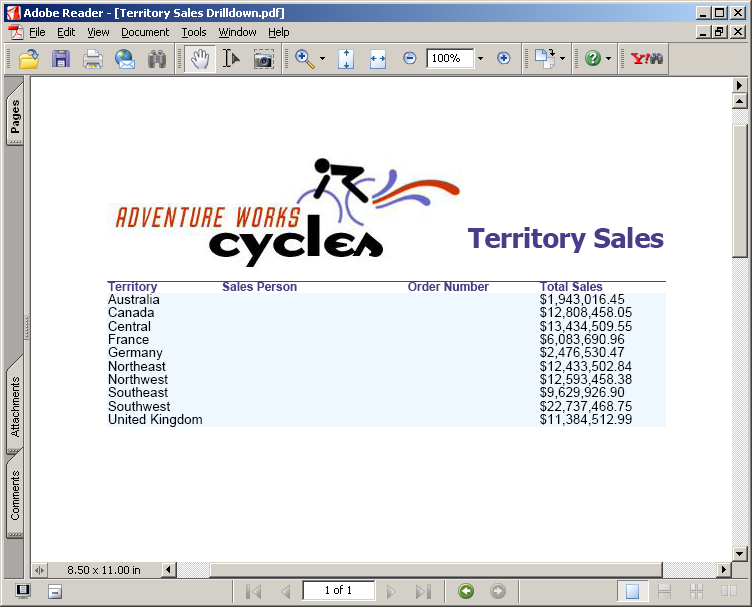
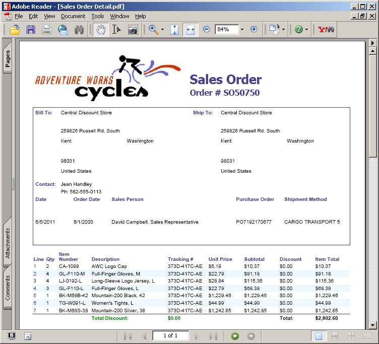
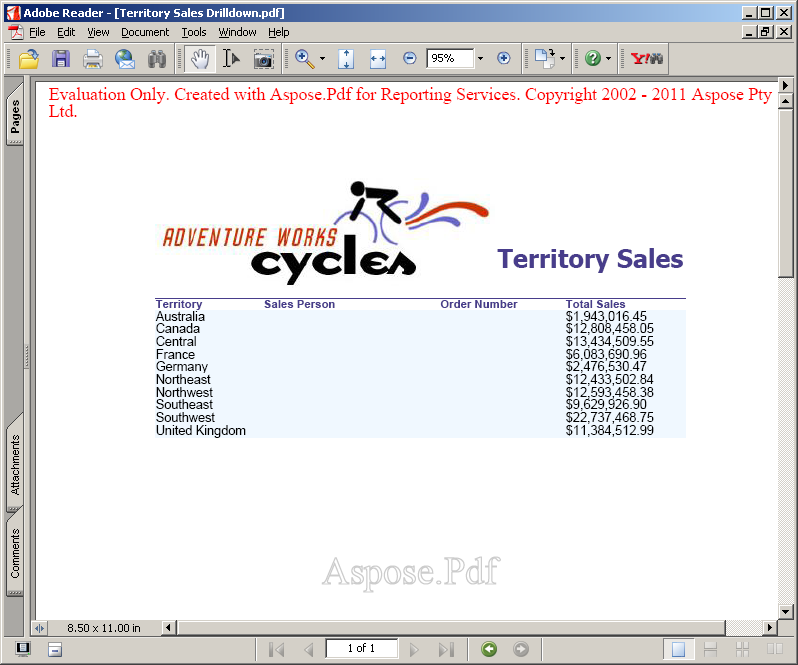

{} 

Aspose.PDF for Reporting Services' evaluation version provides the same set of features as the fully licensed version, with the exception that the evaluation version adds an evaluation watermark to output PDFs.

{} 

When you are happy with your evaluation, [buy a license](http://www.aspose.com/purchase/default.aspx). Before purchasing, make sure you understand and agree to the license subscription terms.

The license is emailed to you when the order has been paid. The license is a clear text, digitally signed XML file and contains information such as the client name, the purchased product and the type of the license. Do not modify the content of the license file as it will invalidate the license.
### **Licensing a Server**
Download the license file and copy it to the C:\Program Files\Microsoft SQL Server\<Instance>\Reporting Services\ReportServer\bin folder on the server(the same folder where Aspose.PDF.ReportingServices.dll is installed).
Where <Instance> is the subdirectory name that corresponds to the Microsoft SQL Server instance you want to license.

- The default instance directory for Microsoft SQL Server 2000 is MSSQL.
- The default instance directory for Microsoft SQL Server 2005 is MSSQL.x, where “x” is the instance identifier.
- The default instance directory for Microsoft SQL Server 2008 is MSRS10.MSSQLSERVER.
#### **Licensing Application Development**
Add a reference to Aspose.PDF for Reporting Services to your project and Aspose.PDF.ReportingServices.dll will be automatically copied to the Bin (binary output) folder of your application.

The license can be loaded from a file, stream or an embedded resource. Aspose.PDF for Reporting Services will try to find the license in the following locations:

- Explicit path.
- The folder that contains Aspose.PDF.ReportingServices.dll.
- The folder that contains the assembly that called Aspose.PDF.ReportingServices.dll.
- The folder that contains the entry assembly (your.exe).
- An embedded resource in the assembly that called Aspose.PDF.ReportingServices.dll.

When using a Visual Studio solution, you see the License.SetLicense method to license the component. The easiest way to set a license is to put the license file in the same folder as the Aspose.PDF.ReportingServices.dll and specify just the file name without a path as shown in the following example:

**C#**



 Aspose.PDF.ReportingServices.License license = new Aspose.PDF.ReportingServices.License();

license.SetLicense("Aspose.PDF.Reporting.Services.lic");



The following example shows how to set a license from a Stream object.

**C#**



 Aspose.PDF.ReportingServices.License license = new Aspose.PDF.ReportingServices. License();

license.SetLicense(mystream);


#### **Deploying a License with your application**
Distribute the license file in the same folder as Aspose.PDF.ReportingServices.dll.
#### **License Generation of Reports at Design Time**
Download the license file and copy it to C:\Program Files\Microsoft Visual Studio <Version>\Common7\IDE\PrivateAssemblies, where <Version> is “8” for Visual Studio 2005 or “9.0” for Visual Studio 2008.
##### **Testing a License**
To test that a license has been installed correctly, export any report as a Portable Format Document (PDF). If the document contains no watermark at the top, the license is activated successfully.

When a valid Aspose.PDF.ReportingServices.lic is present in the ReportServer\bin folder, there will be no evaluation watermark. 

**PDF generated using “Territory sales drilldown” report** 

**PDF generated using “Sales Order details” report** 

If there is a problem while initializing the license, an evaluation watermark is displayed in the resultant PDF document as specified below. 

**PDF document generated using “Territory Sales Drilldown” with watermark** 

Please note that that supported license file names are Aspose.PDF.ReportingServices.lic, Aspose.Total.ReportingServices.lic and Aspose.Total.Product.Family.lic. If the file has any other name, please rename it.
#### **Temporary License**
{} 

You may also request a 30 days temporary license to test the product. Please visit the following link for more information on how to get Temporary license. [Get a Temporary License](http://www.aspose.com/corporate/purchase/temporary-license.aspx).

{}
