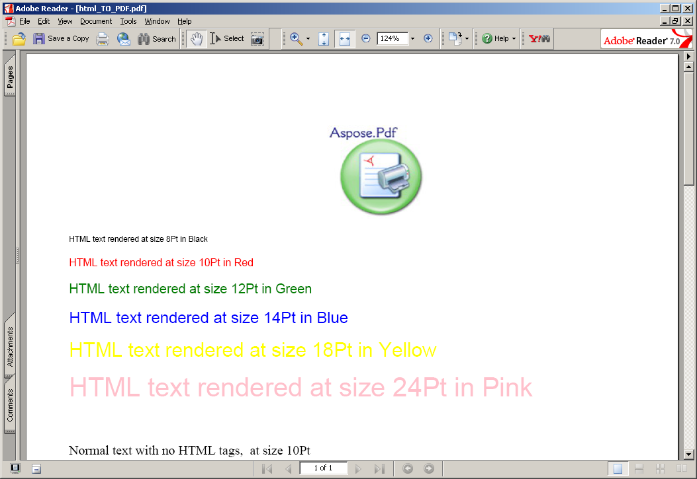

{} 

### **Welcome to Aspose.PDF for Reporting Services!**
Microsoft SQL Server Reporting Services fulfills a need that many organizations have: the need to build business intelligence and reporting solutions. Until now, developers were required to embed reports into their applications, or organizations were required to buy expensive and sometimes problematic third-party reporting solutions. Now, Microsoft SQL Server Reporting Services offers a complete solution for distributing reports across the enterprise; enabling businesses to make decisions better and faster.

{} 
### **Product Description**
Aspose.PDF for Reporting Services is a unique solution from Aspose that makes it possible to export PDF reports in Microsoft SQL Server 2000, 2005,2008, 2012 and 2016 Reporting Services. All RDL report features, including tables, matrices, charts and images are converted with the highest degree of precision to PDF.

Microsoft SQL Server Reporting Services have built-in abilities to export reports as PDF documents, but doesn't provide necessary technical support for its end users. Aspose.PDF provides efficient technical support.

Aspose.PDF for Reporting Services creates documents on the server without the Adobe.Pdf SDK. Aspose.PDF for Reporting Services uses Aspose.PDF for .NET – the world-class component for server-side document processing and conversions.

**Aspose.PDF for Reporting Services makes it possible to export any report in PDF format** 

**Aspose.PDF for Reporting Services exported a report as a PDF file** 

