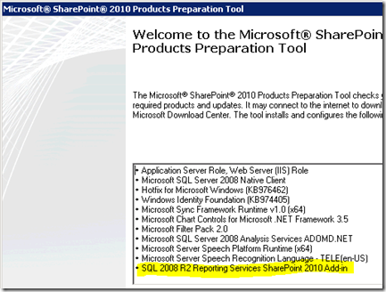

{} 

Aspose.PDF for Reporting Services has been very remarkable for PDF generation through SQL Reporting Services since many years and it provides diverse configuration and parameterization options which are not supported by default in SQL Reporting Services. Recently we have received some requested regarding Aspose.PDF for Reporting Services Integration with SharePoint. For this article, we are going to focus on MS SharePoint 2010. Before we proceed further, we assume that you already have a SharePoint Farm setup. In this example we are going to use full SharePoint Cloud. However the steps are similar for SharePoint Foundation Server.

{} 

Before we proceed further, let’s take a look over reference topics that we have consulted during the preparation of this article.

- [Overview of Reporting Services and SharePoint Technology Integration](http://msdn.microsoft.com/en-us/library/bb326358.aspx)
- [Deployment Topologies for Reporting Services in SharePoint Integrated Mode](http://msdn.microsoft.com/en-us/library/bb510781.aspx)
- [Configuring Reporting Services for SharePoint 2010 Integration](http://msdn.microsoft.com/en-us/library/bb326356.aspx)
##### **Environment Setup Out setup consists of 4 servers. It includes of a Domain Controller, a SQL Server, a SharePoint Server and a server for Reporting Services. You may opt to have SharePoint and Reporting Services on the same box, which will simplify this a bit and I will point out some of the differences.**
##### **Installation Pre-Requisites {} The Reporting Services Add-In for SharePoint is one of the key components to getting Integration working properly. The Add-In needs to be installed on any of the Web Front Ends (WFE) that is in your SharePoint farm along with the Central Admin server. One of the new changes with SQL 2008 R2 & SharePoint 2010 is that the 2008 R2 Add-In is now a pre-requisite for the SharePoint Install. This means that the RS Add-In will be laid down when you go to install SharePoint. It has been shown and highlighted in figure below. This actually avoids a lot of issues we saw with SP 2007 and RS 2008 when installing the Add-In.  Image1 :- Reporting Services Add-in for Share Point {}**
##### **SharePoint Authentication Before we jump into the RS Integration pieces, one thing I want to point out about the SharePoint Farm is how you setup the Site. More specifically how you configure authentication for the site. Whether it will be Classic or Claims. This choice is important in the beginning. I don't believe that you can change this option once it is done. If you can change it, it would not be a simple process. NOTE: Reporting Services 2008 R2 is NOT Claims aware Even if you choose your SharePoint site to use Claims, Reporting Services itself isn't Claims aware. That said, it does affect how authentication works with Reporting Services. So, what is the difference from a Reporting Services perspective? It comes down to whether you want to forward User Credentials to the data source. Classic:- Can use Kerberos and forward the user's credentials to your back end datasource (will need to use Kerberos for that). Claims:- A Claims token is used and not a windows token. RS will always use Trusted Authentication in this scenario and will only have access to the SPUser token. You will need to store your credentials within your data source. For now we just want to focus on setup of RS. At this point SharePoint is installed on my SharePoint Box and setup with a Classic Auth Site on port 80. On the RS Server I have just installed Reporting Services and that's it.**
