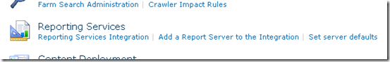
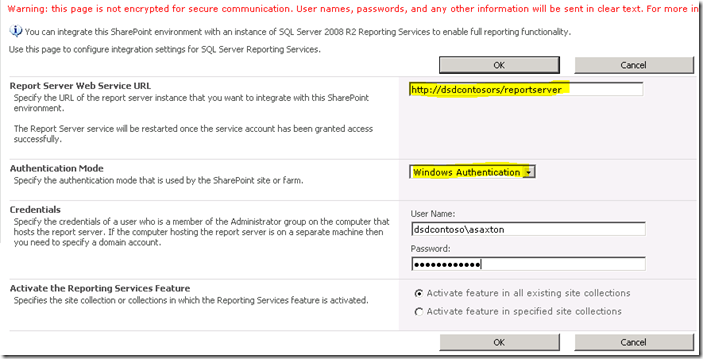
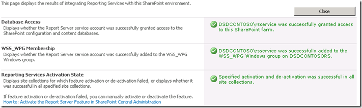
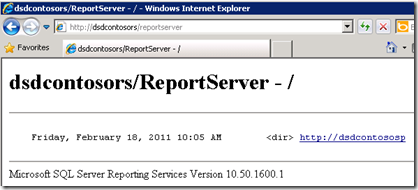
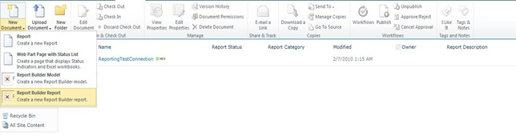
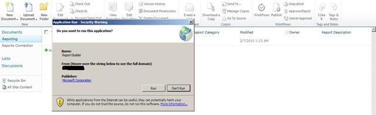
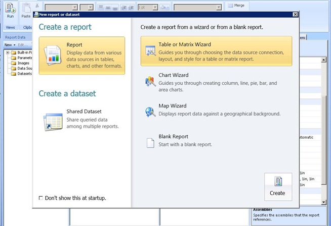
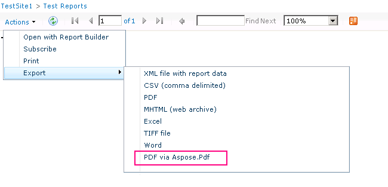

{} 

Now that SharePoint is installed and configured on the RS server and RS is setup and setup through the Reporting Services Configuration Manager, we can move onto the configuration within Central Admin. RS 2008 R2 has really simplified this process. We use to have a 3 step process that you had to perform to get this to work. Now we just have one step.

{} 

We want to go to the Central Administrator Web site and then into General Application Settings. Towards the bottom we will see Reporting Services. 

**Image1**:- SharePoint configuration dialog

Select "Reporting Services Integration" link. Following screen will be displayed. 

**Image2**:- Specify Reporting Services integration credentials 
##### **Web Service URL: We will provide the URL for the Report Server that we found in the Reporting Services Configuration Manager.**
##### **Authentication Mode: {} We will also select an Authentication Mode. The following MSDN link goes through in detail what these are. Security Overview for Reporting Services in SharePoint Integrated Mode {} In short, if your site is using Claims Authentication, you will always be using Trusted Authentication regardless of what you choose here. If you want to pass windows credentials, you will want to choose Windows Authentication. For Trusted Authentication, we will pass the SPUser token and not rely on the Windows credential. You will also want to use Trusted Authentication if you have configured your Classic Mode sites for NTLM and RS is setup for NTLM. Kerberos would be needed to use Windows Authentication and to pass that through for your data source.**
##### **Activate feature: This gives you an option of activating the Reporting Services on all Site collections, or you can choose which ones you want to activate it on. This just really means which sites will be able to use Reporting Services. When it is done, you should see the following results  Image3:- Successful integration of Reporting Services with SharePoint environment Going back to the ReportServer URL, we should see something similar to the following  Image4:- Reporting Services is successfully connected with SharePoint environment NOTE: If your SharePoint site is configured for SSL, it won't show up in this list. It is a known issue and doesn't mean there is a problem. Your reports should still work. Now that we have successfully integrated both products, we are ready to use Reporting Services in SharePoint 2010. As the previous version we have a feature (activated when we configure Reporting Services Integration) in the “Site Collection Feature”. Also the installation added 3 content types to add to our site. In Image 7 we can see 2 of them content types added in a document library to create a custom report us ing the, as we can see in Image5 below.  Image5:- Report Builder The “Reporter Builder” is an ActiveX control so we need to download it over the server, as we can see in Image 6 below.  Image6:- Download and install Report Builder Once the download process is completed, load the “Report Builder” control. Now we are ready to design our first report, as shown in Image7 below.  Image7:- Report Builder – New Report generation wizard After create our report we could save it in the document library created to put the reports in our SharePoint 2010. The other content type must be used to create shared connection as data source and save them in a document library in SharePoint. We can create a document library, add this content type and after we can have our connections available to change the data source of the reports.  Image8:- Successful Integration of Aspose.PDF for Reporting Services with MS SharePoint**
