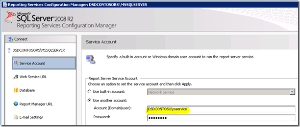
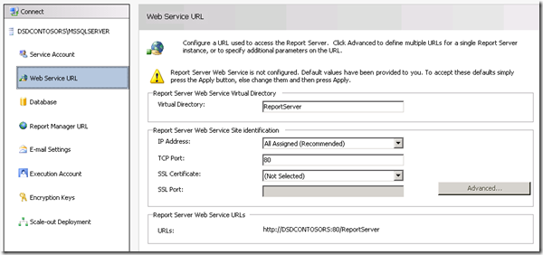
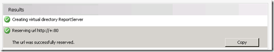
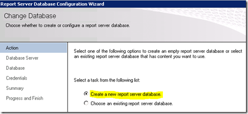
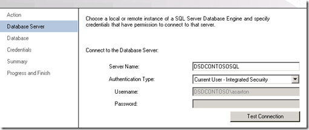
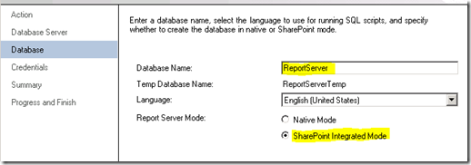
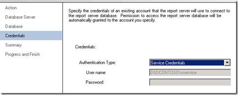
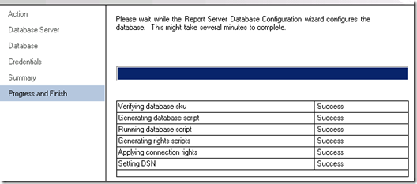
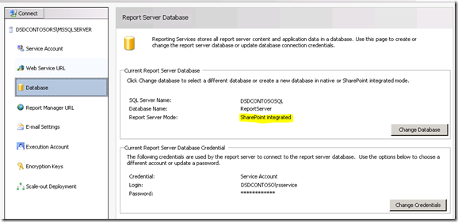
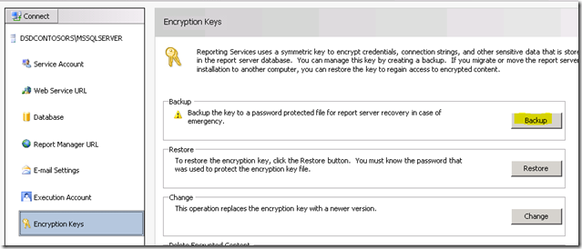

{} 

Our first stop on the Reporting Services Server is the Reporting Services Configuration Manager.

{} 
##### **Service Account: Be sure to understand what service account you are using for Reporting Services. If we run into issues, it may be related to the service account you are using. The default is Network Service. When we go to deploy new builds, we always use Domain Accounts, because that is where we are likely to hit issues. For this instance of server, we have used a Domain Account called RSService.  Image1:- Setting-up service account**
##### **Web Service URL: {} We will need to configure the Web Service URL. This is the ReportServer virtual directory (vdir) that hosts the Web Services Reporting Services uses, and what SharePoint will communicate with. Unless you want to customize the properties of the vdir (i.e. SSL, ports, host headers, etc…), you should just be able to click Apply here and be good to go.  Image2:- Setting up Web Service URL Once Web service URL have been setup, you should able to see the following results  Image3:- Successful setup of Web service URL {}**
##### **Database: We need to create the Reporting Services Catalog Database. This can be placed on any SQL 2008 or SQL 2008 R2 Database Engine. SQL11 would work ok as well, but that is still in BETA. This action will create two databases, ReportServer and ReportServerTempDB, by default. The other important step with this is to make sure that you choose SharePoint Integrated for the database type. Once this choice is made, it cannot be changed.  Image4:- Creating report server database  Image5:- Setting up database server and authentication type  Image6:- Setting up database name and Mode For the credentials, this is how the Report Server will communicate with the SQL Server. Whatever account you select, will be given certain rights within the Catalog database as well as a few of the system databases via the RSExecRole. MSDB is one of these database for Subscription usage as we make use of SQL Agent.  Image7:- Setting up Report Server database credentials Once database credentials are specified, we should be able to get the results as specified below.  Image8:- Report Server database creation progress  Image9:- Report Server database completion summary**
##### **Report Manager URL: {} We can skip the Report Manager URL as it isn't used when we are in SharePoint Integrated mode. SharePoint is our frontend. Report Manager doesn't work. {}**
##### **Encryption Keys: Backup your Encryption Keys and make sure you know where you keep them. If you get into a situation where you need to migrate the Database or restore it, you will need these.  Image10:- Report Server Encryption key backup Congratulation! We have successfully configured Reporting Services using Configuration Manager. If you browse to the URL on the Web Service URL tab, it should show something similar to the following.  Image11:- Report Server access after installation Reason of error: SharePoint is installed on our WFE and we finished setting up Reporting Services. In this example, Reporting Services and SharePoint are on different machines. If they were on the same machine, you wouldn't have seen this error. We technically need to install SharePoint on the RS Box. That means IIS will be enabled as well.**
