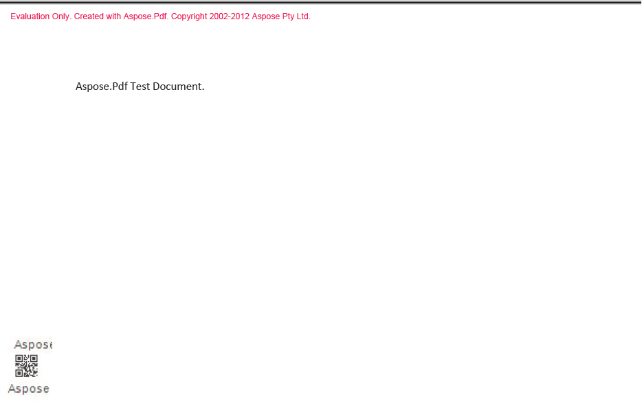
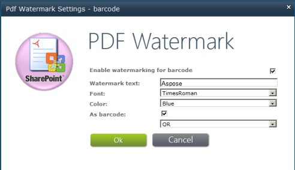

{} 

Aspose.PDF for SharePoint lets you add a barcode to a PDF document. Users can add a barcode to the bottom left corner of every page of a PDF document added to the library. The image below gives an idea of how a PDF document with a barcode added may look.

**Barcode on bottom left corner** 

{} 

To enable the barcode feature for a specific library, use the **Watermark Settings** button in the **Aspose PDF Watermark Tools** tab in **Library Tools** as shown below.

**PDF watermark settings** 

After you enable barcodes for the specific library, Aspose.PDF for SharePoint adds a barcode to any PDF document added to that library.
