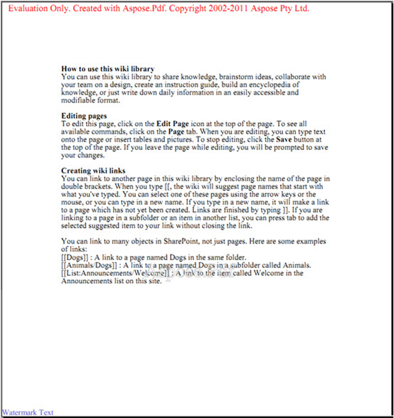
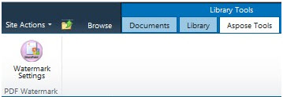
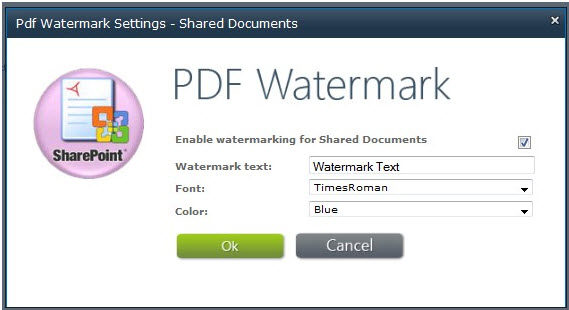

{} 

Aspose.PDF for SharePoint lets you add watermark to a PDF document. The feature adds a text watermark to the bottom left corner of every page in a PDF document added to the library. 

**Watermark Text on bottom left corner** 

{} 

To enable watermark feature for a specific library:

1. Click **Watermark Settings** in the **Aspose Tools** tab in the **Library Tools** dialog. 

   **Library tools** 

Watermark settings are list-specific so you can choose different watermark setting for different libraries. The following screen shot shows the Watermark Settings dialog for the **Shared Documents** library. 

**Watermark settings** 

- Select **Enable watermarking for** to enable the watermark feature for a specific list.
- **Watermark text** – the text that will appear on the page as a watermark.
- **Font** – the font used for the watermark.
- **Color** – the watermark's color.

After you enable watermark for a specific library, Aspose.PDF adds watermarks to each PDF document added to that library.
