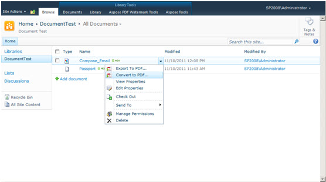

{} 

Aspose.PDF for SharePoint allows converting HTML files, text files, and images (JPG, PNG, GIF, TIFF, BMP) to PDF format.

{} 

To convert a document to PDF:

1. Click **Convert to PDF** in the ECB menu.
1. Download and save the resultant PDF file.

**Convert to PDF option in the ECB menu** 

## **PDF Creator information**
- Please note that you cannot set values against the **Application** and **Producer** fields, because Aspose Ltd. and Aspose.PDF for SharePoint x.x.x will be displayed against these fields. 
