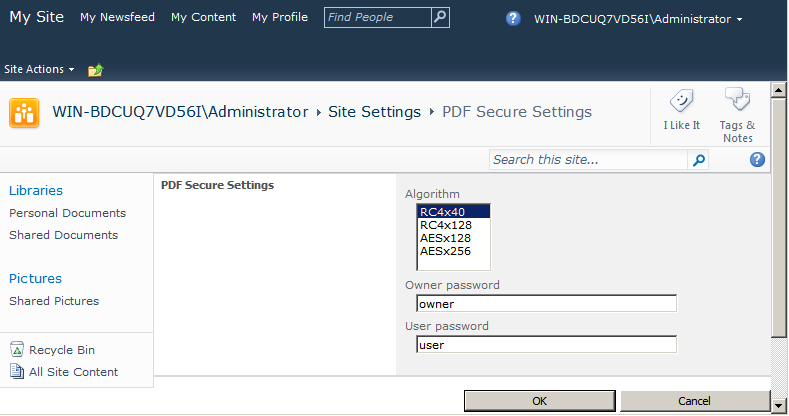
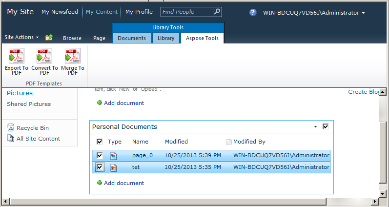
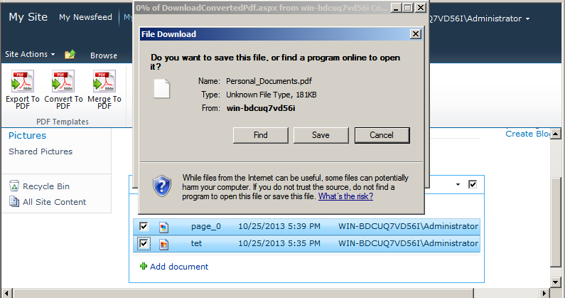
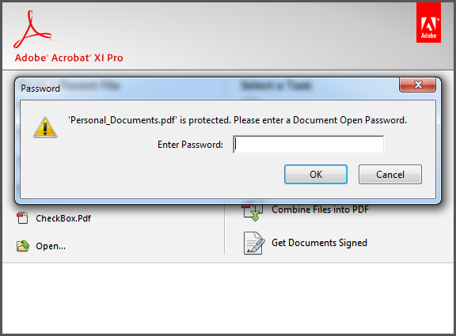

{} 

Aspose.PDF for SharePoint supports creating secure PDFs. Installing Aspose.PDF for SharePoint adds a **PDF Secure Settings** option in Site Setting. Here, You can set the user password, owner password and any value from the algorithm list to encrypt the output PDF. The algorithm list provides different combinations of encryption algorithms and key sizes. Pass the value of your choice.

This article demonstrates how to use Aspose.PDF for SharePoint to generate an encrypted PDF.

{} 
### **Creating a Secure PDF**
To demonstrate the feature, first we configure the **PDF Secure Setting** option for owner and user password and encryption algorithm. The example then merges two documents from a document library.
#### **Setting PDF Secure Setting Options**
Open **PDF Secure Settings** option from Site Settings and set algorithm, owner password and user password.

Specify different user and owner passwords while encrypting PDF file.

- The user password, if set, is what you need to provide in order to open a PDF. Acrobat Reader prompts a user to enter the user password. If it's wrong, the document does not open.
- The owner password, if set, controls permissions such as printing, editing, extracting, commenting, etc. Acrobat Reader disallows these features based on the permission settings. Acrobat requires this password if you want to set/change permissions.

#### **Merge Documents**
Merge two documents using the **Convert to PDF** option. This feature merges multiple non-PDF files (HTML, text or image) into a PDF file.

1. Open a document library and select desired documents from the list. 

1. Use the **Merge to PDF** option from Library Tools to save the output file. You are prompted to save output file to disk. 

#### **Output**
Output file is encrypted.

