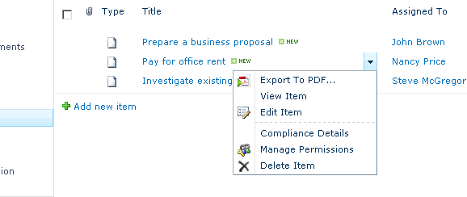
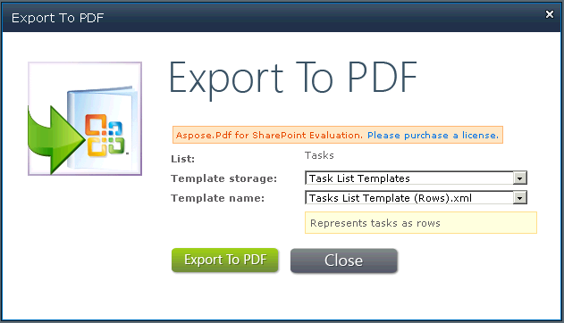

{} 

Aspose.PDF for SharePoint lets you convert several documents, or one at a time. This article shows how to export an item from a list.

{} 

To export a particular item from a list: select **Export to Pdf** from the item's Edit Control Block (ECB). 

**Selecting Export to Pdf in the item's ECB** 

**Export to PDF** 

