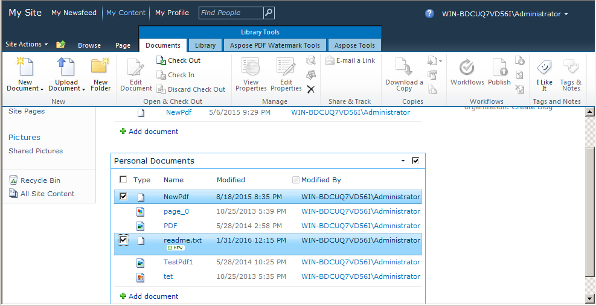
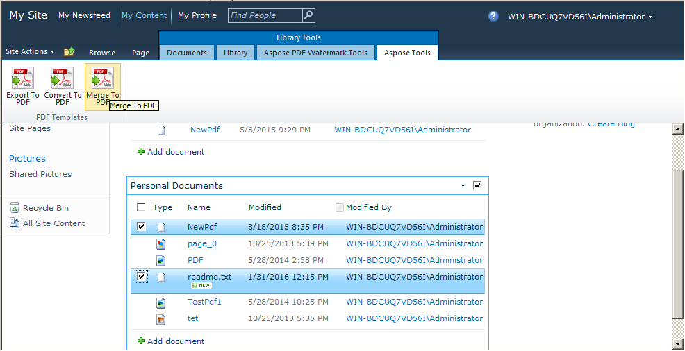
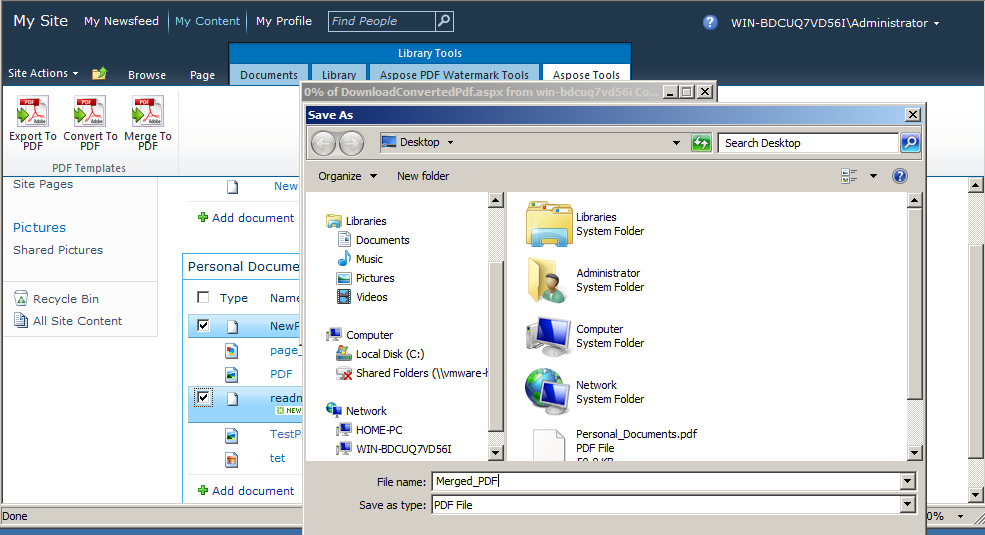

{} 

Merging/concatenating of multiple PDF files into a single PDF file is very popular and demanding feature in PDF file processing applications. We have introduced this important feature in [Aspose.PDF for SharePoint 2.2.0](http://www.aspose.com/community/files/73/sharepoint-components/aspose.pdf-for-sharepoint/entry679427.aspx) version. Merging two files is, creating a single file by adding second file to the end of first file.

{} 
### **Merge PDF files**
Merge multiple PDF files from SharePoint Document library in a single PDF as following:

\1.  Select the PDF files from SharePoint Document library to be merged.

\2.  Click Aspose Tools tab in Library Tools.

\3.  Click Merge to PDF option from Library Tools to merge all the selected PDF files to resultant PDF.

\4.  Prompt will be shown to download/save the resultant PDF file with appropriate name.

