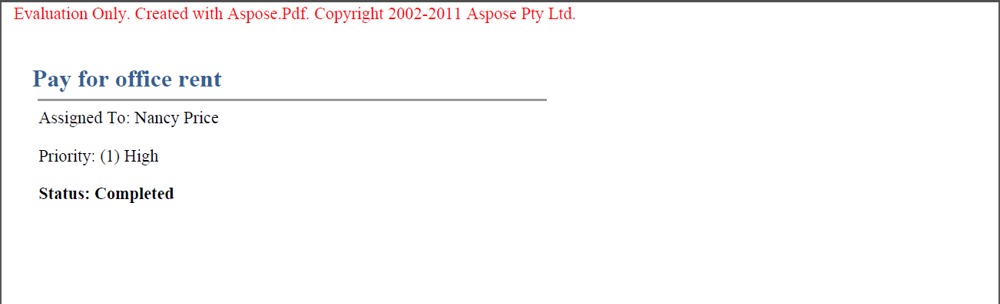

{} 

Make sure to take advantage of the free Aspose.PDF for SharePoint evaluation as it has no time limit, and free technical support is provided for evaluation users too.

{} 

It is the same download for both the evaluation and the paid version of Aspose.PDF for SharePoint. Simply download Aspose.PDF for SharePoint from the download page, install it and it will work in the evaluation mode by default.

Evaluation mode injects an Evaluation Warning into exported documents. When you have purchased a license, simply install the license solution over installed evaluation copy of Aspose.PDF for SharePoint and it will then work in the licensed mode.

**Aspose.PDF** **for SharePoint injects an Evaluation Warning when working in the evaluation mode.** 

