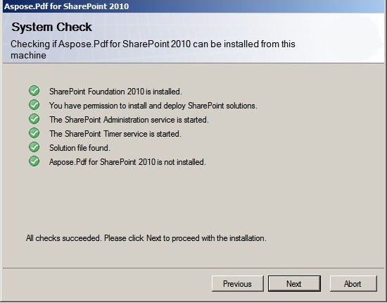
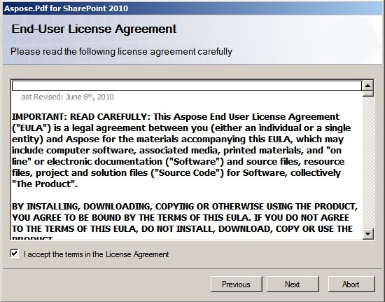
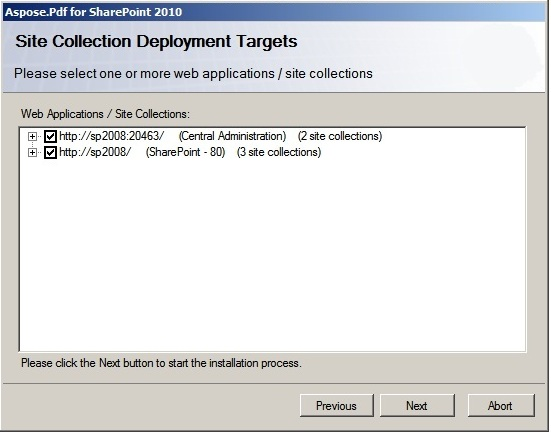
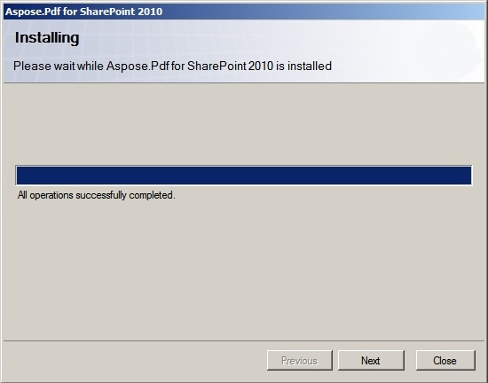
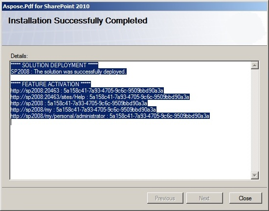

{} 

Aspose.PDF for SharePoint is downloadable as Aspose.PDF.SharePoint.zip archive.

{} 

**This archive contains:**

- Aspose.PDF.SharePoint.wsp
  SharePoint solution file. Aspose.PDF for SharePoint is packaged as a SharePoint solution to facilitate deployment/retraction and feature activation/deactivation across the server farm.
- Aspose_LicenseAgreement.rtf

**End user license agreement:**

- Aspose.PDF for SharePoint.pdf

**User documentation:**

- Aspose.PDF for SharePoint Documentation.chm

**User documentation with Public API reference:**

- setup.exe

**Setup program:**

- setup.exe.config

**Setup configuration file:**

The setup program checks the following conditions before proceeding:

- SharePoint 2010 is installed.
- The user has permission to install SharePoint solutions.
- SharePoint database is online.
- SharePoint Administration service is started.
- SharePoint Timer service is started. SharePoint Administration service and Timer service are needed because some setup actions rely on a timer job to propagate to all servers in the server farm.

**To install Aspose.PDF for SharePoint:**

- Unpack Aspose.PDF.SharePoint zip to the local drive.
- Run setup.exe and follow the instructions on the screen.

**The setup program performs the following actions:**

- Check installation prerequisites. Setup will not continue if any check fails. 

- Display End User License Agreement. The user must accept the agreement in order to proceed. 

- Display deployment target selection dialog. The user selects web applications and site collections where the feature shall be activated. See the figure below. 

- Deploy the feature to the server farm. 

- Activate the feature for the selected site collections and configure their parent web applications.
- Display a list of web applications and site collections where the feature has been deployed and activated. 

