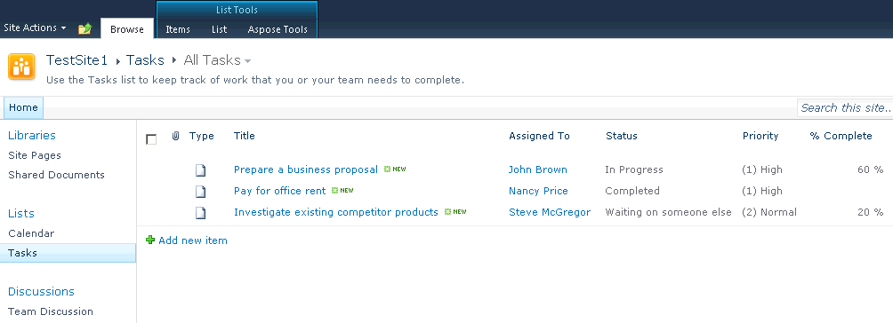

{} 

### **Welcome to the Aspose.PDF for SharePoint Documentation!**
Aspose.PDF for SharePoint is a solution that allows the users to export lists, list items and SharePoint Wiki pages to the PDF file format. 

{} 

Aspose.PDF for SharePoint is designed to be used with Microsoft SharePoint Server 2010. There are no additional system requirements besides Microsoft SharePoint Server 2010. 

This documentation describes Aspose.PDF for SharePoint's [features](/pdf/sharepoint/features-html/), [installation](/pdf/sharepoint/install-aspose-pdf-for-sharepoint-html/), [evaluation limitations](/pdf/sharepoint/evaluate-aspose-pdf-html/), [licensing](/pdf/sharepoint/license-aspose-pdf-for-sharepoint-html/), common use cases and settings.

**The tab Aspose Tools on the Lists and Libraries ribbon shows that Aspose.PDF for SharePoint is installed** 

