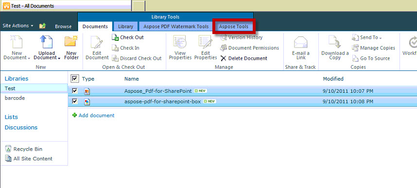
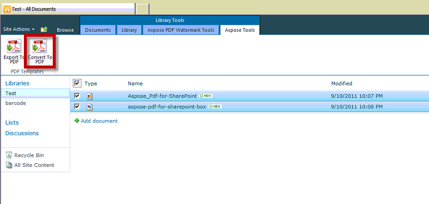
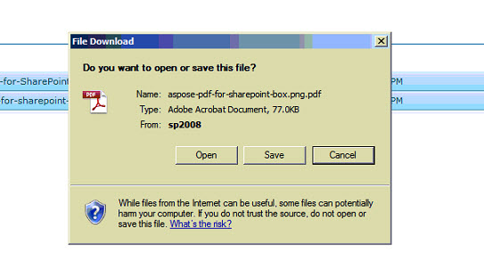
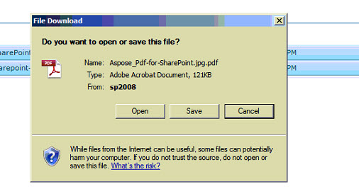

{} 

This article shows how to convert multiple selected files to PDF files with a single conversion operation using Aspose.PDF for SharePoint.

{} 

To convert multiple selected files, perform the following steps:

1. Select the files to be converted 

1. Click Aspose Tools tab in Library Tools 

1. Click Convert to PDF to convert all the selected files to resultant PDF files. 

1. Prompt will be shown to download the converted files. 

