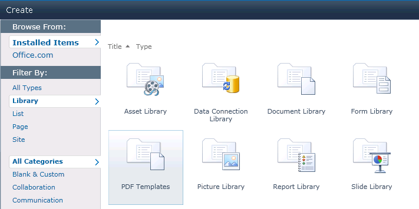
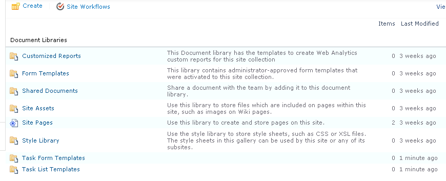
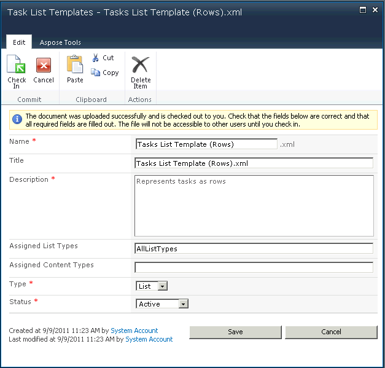
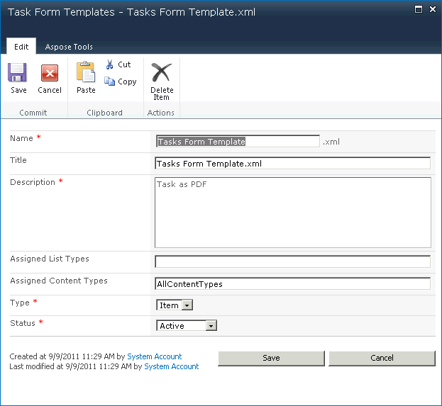
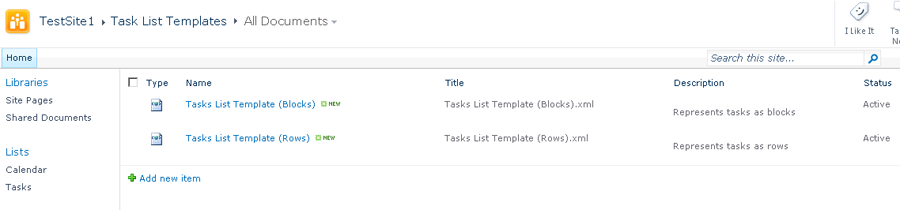
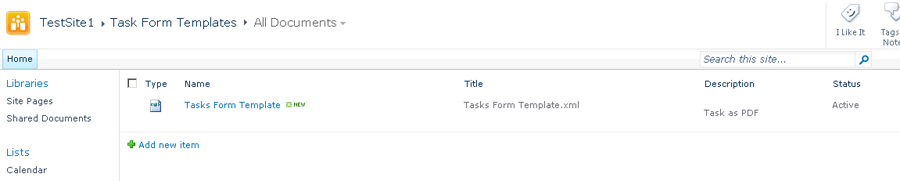
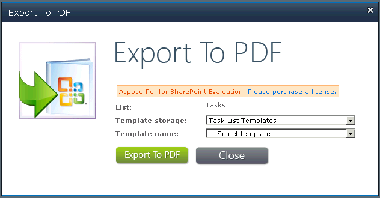

{} 

This article shows how to create and export templates using Aspose.PDF for SharePoint.

From Aspose.PDF for SharePoint 1.9.2, PDF template support also covers SharePoint subsites.

{} 
### **Creating and Exporting Templates**
To use the Aspose.PDF for SharePoint export feature, first create a list that uses “PDF Templates”.

Creating a list that uses PDF Templates: 

Two document templates, Task Form Templates and Task List Templates are created: 

The template form lets you enter the following information:

- **Name**: the template's file name.
- **Title**: the template's title. (By default, the same as the file name.)
- **Description**: a description of the template. A good description makes the template easier to use.
- **Assigned List Types**: comma separated list IDs (related to the template. This field may also contain the value **AllListTypes**. This field is only applicable when the **Type** field is set to **List**).
- **Assigned Content Types**: Comma separated content type IDs (related to the template. This field may contain be set to **AllListTypes**. This field is only applicable when the **Type** field is set to **Item**.
- **Type**: either list template or item template.
- **Status**: the options are active, inactive (invisible to all), and debugging (visible only to admins).

**The Task List Templates form:** 

**The Task Form Templates form:** 

When they have been saved, the new templates show up in the template list, ready to be used:

**Two task list templates:** 

**A task forms template:** 

#### **Developing Templates**
A template is an XML file based on Aspose XML PDF. To make a template for a list, place special markers related to the SharePoint target content type field’s internal name into the XML PDF file.
##### **Markers**
- **SPListItemsCount** – replaced by count of list items.
- **SPListTitle** – replaced by list title.
- **SPTableIterator** – placed to first table cell and mark table for full iteration.
- **SPRowIterator** – placed to first table cell and mark table for row iteration.
- **SPField** – replaced by value of item field.

For reference, please download [template XML files](attachments/8421394/8618082.zip).
#### **Export to PDF**
When a template is completely configured, you are ready to export lists or items to PDF files.

**Exporting a list to PDF using a task list template:** 

