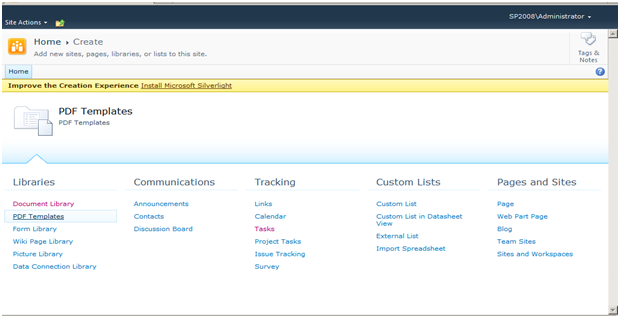
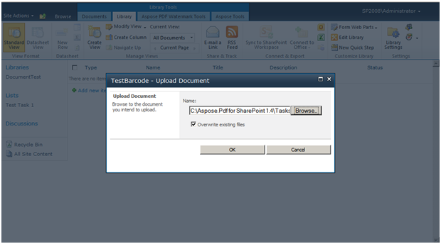
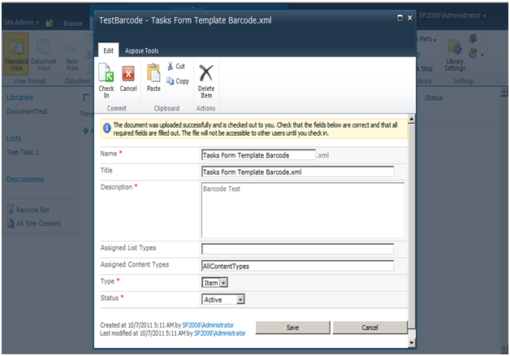
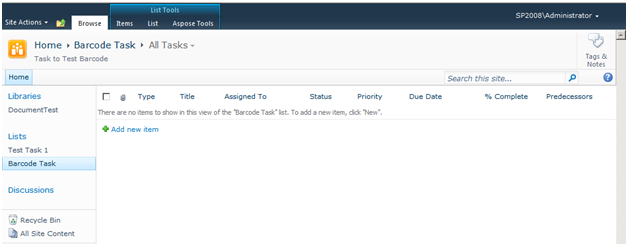
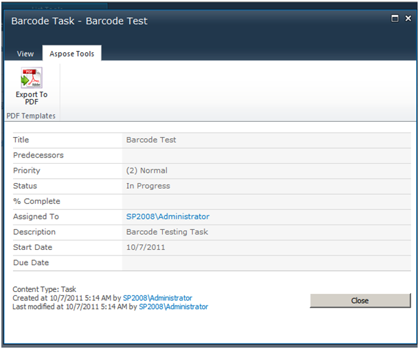
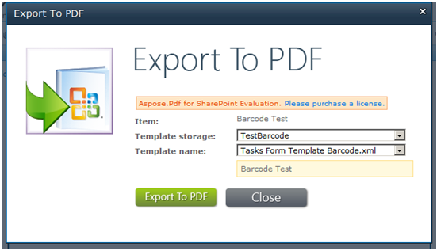
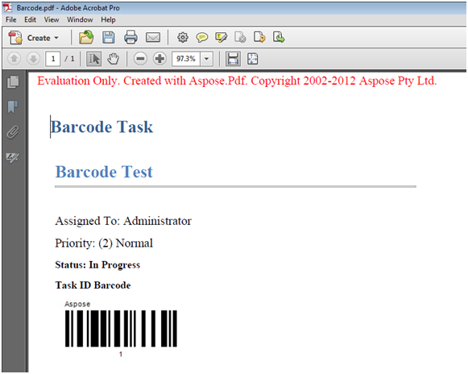

{} 

This article shows how to set up and export a task list to PDF with barcodes using Aspose.PDF for SharePoint.

{} 

To export a task list to PDF with a barcode using the template engine, take the following steps:

1. Create and upload a template.
1. Complete template fields and save the template.
1. Create and save a new task.
1. Export the document to PDF.

The process is given in detail below.
#### **Exporting Task List to PDF**
1. Create a PDF template list. 

1. After creating the template, click **Add New Item** in the list and upload the XML file. 

1. When uploaded is complete, click **OK**.
1. Fill in the form fields.
1. Save the template. 

The template has been configured. 

1. Go to the **Tasks** list and create a new task.
1. Save the task. 

1. On the **Aspose Tools** tab, click **Export To PDF**. 

1. Select the configured template and click **Export**. 

The exported PDF: 

